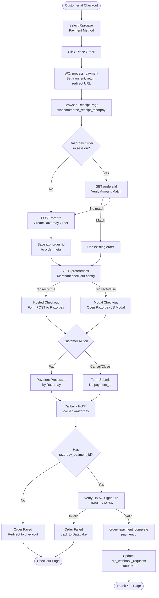
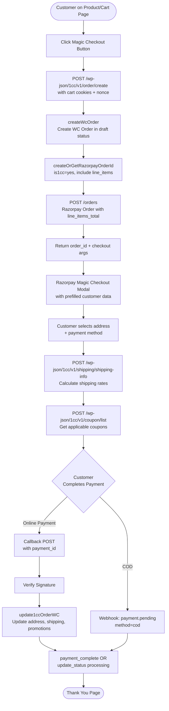

# High-Level Payment Flow Diagram

## Standard Payment Flow

```mermaid
flowchart TD
    A([Customer at Checkout]) --> B[Select Razorpay\nPayment Method]
    B --> C[Click 'Place Order']
    C --> D[WC: process_payment\nSet transient, return redirect URL]
    D --> E[Browser: Receipt Page\nwoocommerce_receipt_razorpay]
    E --> F{Razorpay Order\nin session?}
    F -->|No| G[POST /orders\nCreate Razorpay Order]
    F -->|Yes| H[GET /orders/id\nVerify Amount Match]
    H -->|Match| I[Use existing order]
    H -->|No match| G
    G --> J[Save rzp_order_id\nto order meta]
    I --> K[GET /preferences\nMerchant checkout config]
    J --> K
    K -->|redirect=true| L[Hosted Checkout\nForm POST to Razorpay]
    K -->|redirect=false| M[Modal Checkout\nOpen Razorpay JS Modal]
    M --> N{Customer Action}
    L --> N
    N -->|Pay| O[Payment Processed\nby Razorpay]
    N -->|Cancel/Close| P[Form Submit\nNo payment_id]
    O --> Q[Callback POST\n?wc-api=razorpay]
    P --> Q
    Q --> R{Has\nrazorpay_payment_id?}
    R -->|No| S[Order Failed\nRedirect to checkout]
    R -->|Yes| T[Verify HMAC Signature\nHMAC-SHA256]
    T -->|Invalid| U[Order Failed\ntrack to DataLake]
    T -->|Valid| V[order->payment_complete\npaymentId]
    V --> W[Update rzp_webhook_requests\nstatus = 1]
    W --> X([Thank You Page])
    S --> Y([Checkout Page])
    U --> Y
```

## Magic Checkout (1CC) Payment Flow

```mermaid
flowchart TD
    A([Customer on Product/Cart Page]) --> B[Click Magic Checkout Button]
    B --> C[POST /wp-json/1cc/v1/order/create\nwith cart cookies + nonce]
    C --> D[createWcOrder\nCreate WC Order in draft status]
    D --> E[createOrGetRazorpayOrderId\nis1cc=yes, include line_items]
    E --> F[POST /orders\nRazorpay Order with line_items_total]
    F --> G[Return order_id + checkout args]
    G --> H[Razorpay Magic Checkout Modal\nwith prefilled customer data]
    H --> I[Customer selects address\n+ payment method]
    I --> J[POST /wp-json/1cc/v1/shipping/shipping-info\nCalculate shipping rates]
    J --> K[POST /wp-json/1cc/v1/coupon/list\nGet applicable coupons]
    K --> L{Customer\nCompletes Payment}
    L -->|Online Payment| M[Callback POST\nwith payment_id]
    L -->|COD| N[Webhook: payment.pending\nmethod=cod]
    M --> O[Verify Signature]
    O --> P[update1ccOrderWC\nUpdate address, shipping, promotions]
    P --> Q[payment_complete OR\nupdate_status processing]
    N --> Q
    Q --> R([Thank You Page])
```
