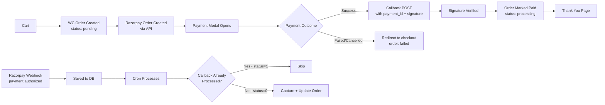

# High-Level System Overview — Razorpay WooCommerce Plugin

## System Architecture Diagram

```mermaid
graph TB
    subgraph Customer["Customer Browser"]
        CB[Customer Browser / Mobile App]
    end

    subgraph WP["WordPress / WooCommerce Server"]
        WC[WooCommerce Core]
        GW[WC_Razorpay Gateway]
        WH[RZP_Webhook Handler]
        API1CC[1CC REST API Endpoints]
        CRON[WP Cron Jobs]
        DB[(WordPress DB)]
    end

    subgraph RZP["Razorpay Platform"]
        RZPAPI[Razorpay API<br/>api.razorpay.com]
        RZPCHECKOUT[Razorpay Checkout<br/>checkout.razorpay.com]
        RZPWEBHOOK[Razorpay Webhook<br/>Engine]
        RZPLUMBERJACK[Lumberjack<br/>Analytics]
    end

    subgraph ThirdParty["Third-Party Integrations"]
        GCPLUGINS[Gift Card Plugins<br/>YITH / PW]
        WALLET[Woo Wallet<br/>Terra Wallet]
        CARTBOUNTY[CartBounty / WATI<br/>Abandoned Cart]
        WCFM[WCFM Marketplace<br/>Multi-vendor]
    end

    CB -->|1. Browse & Add to Cart| WC
    CB -->|2. Checkout → Place Order| GW
    GW -->|3. Create Razorpay Order| RZPAPI
    RZPAPI -->|4. Order ID| GW
    GW -->|5. Render Payment Form| CB
    CB -->|6. Open Payment Modal| RZPCHECKOUT
    CB -->|7. Complete Payment| RZPCHECKOUT
    RZPCHECKOUT -->|8. Callback POST| GW
    GW -->|9. Verify Signature| RZPAPI
    GW -->|10. Mark Order Paid| WC
    GW -->|11. Save Order Meta| DB

    RZPWEBHOOK -->|Async: payment.authorized| WH
    WH -->|Save to DB| DB
    CRON -->|Process pending payments| WH
    WH -->|Capture payment| RZPAPI
    WH -->|Update order| WC

    CB -->|1CC: Create Order| API1CC
    API1CC -->|Create WC Order| WC
    API1CC -->|Create Razorpay Order| RZPAPI
    API1CC -->|Calculate Shipping| WC
    API1CC -->|Apply Coupons| WC

    GW -->|Track events| RZPAPI
    GW -->|DataLake events| RZPLUMBERJACK

    WC -->|Refund| GW
    GW -->|Initiate Refund| RZPAPI

    GW <-->|Gift Cards| GCPLUGINS
    GW <-->|Wallet Payment| WALLET
    GW <-->|Cart Recovery| CARTBOUNTY
    GW <-->|Multi-vendor Shipping| WCFM
```

## Component Responsibilities

| Component | Technology | Key Role |
|---|---|---|
| `WC_Razorpay` | PHP / WooCommerce | Gateway registration, payment form, callback handling, refunds |
| `RZP_Webhook` | PHP | Webhook receipt, signature verification, event routing |
| `1CC REST API` | WP REST API (PHP) | Server-side endpoints for Magic Checkout flow |
| `WP Cron` | WordPress Cron | Process unhandled payment.authorized events |
| `script.js` | JavaScript | Open Razorpay checkout modal, submit callback form |
| `btn-1cc-checkout.js` | JavaScript | Magic Checkout button rendering and flow |
| `checkout-block.php` / `checkout_block.js` | PHP + JS | WooCommerce Blocks integration |
| Razorpay PHP SDK | PHP | API client for all Razorpay API calls |

## Data Flow Summary

