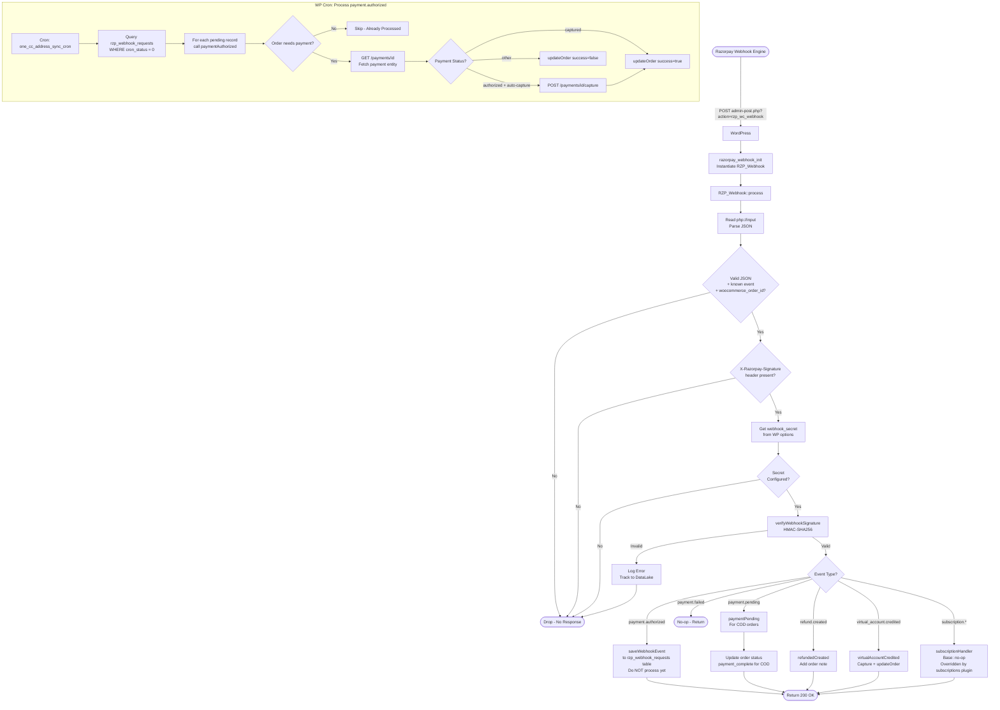
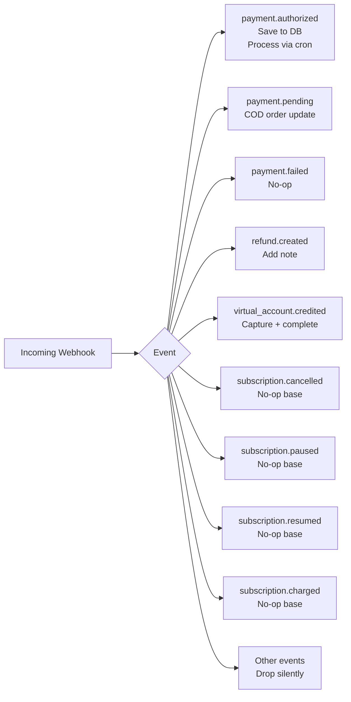

# High-Level Webhook Flow Diagram

## Webhook Processing Architecture

```mermaid
flowchart TD
    A([Razorpay Webhook Engine]) -->|POST admin-post.php?action=rzp_wc_webhook| B[WordPress]
    B --> C[razorpay_webhook_init\nInstantiate RZP_Webhook]
    C --> D[RZP_Webhook::process]
    D --> E[Read php://input\nParse JSON]
    E --> F{Valid JSON\n+ known event\n+ woocommerce_order_id?}
    F -->|No| G([Drop - No Response])
    F -->|Yes| H{X-Razorpay-Signature\nheader present?}
    H -->|No| G
    H -->|Yes| I[Get webhook_secret\nfrom WP options]
    I --> J{Secret\nConfigured?}
    J -->|No| G
    J -->|Yes| K[verifyWebhookSignature\nHMAC-SHA256]
    K -->|Invalid| L[Log Error\nTrack to DataLake]
    L --> G
    K -->|Valid| M{Event Type?}

    M -->|payment.authorized| N[saveWebhookEvent\nto rzp_webhook_requests table\nDo NOT process yet]
    M -->|payment.pending| O[paymentPending\nFor COD orders]
    M -->|payment.failed| P([No-op - Return])
    M -->|refund.created| Q[refundedCreated\nAdd order note]
    M -->|virtual_account.credited| R[virtualAccountCredited\nCapture + updateOrder]
    M -->|subscription.*| S[subscriptionHandler\nBase: no-op\nOverridden by subscriptions plugin]

    N --> T([Return 200 OK])
    O --> U[Update order status\npayment_complete for COD]
    U --> T
    Q --> T
    R --> T
    S --> T

    subgraph CronProcessing["WP Cron: Process payment.authorized"]
        V[Cron: one_cc_address_sync_cron] --> W[Query rzp_webhook_requests\nWHERE cron_status = 0]
        W --> X[For each pending record\ncall paymentAuthorized]
        X --> Y{Order needs payment?}
        Y -->|No| Z[Skip - Already Processed]
        Y -->|Yes| AA[GET /payments/id\nFetch payment entity]
        AA --> AB{Payment Status?}
        AB -->|captured| AC[updateOrder success=true]
        AB -->|authorized + auto-capture| AD[POST /payments/id/capture]
        AD --> AC
        AB -->|other| AE[updateOrder success=false]
    end
```

## Webhook Event Decision Tree

```mermaid
flowchart LR
    A[Incoming Webhook] --> B{Event}
    B --> C[payment.authorized\nSave to DB\nProcess via cron]
    B --> D[payment.pending\nCOD order update]
    B --> E[payment.failed\nNo-op]
    B --> F[refund.created\nAdd note]
    B --> G[virtual_account.credited\nCapture + complete]
    B --> H[subscription.cancelled\nNo-op base]
    B --> I[subscription.paused\nNo-op base]
    B --> J[subscription.resumed\nNo-op base]
    B --> K[subscription.charged\nNo-op base]
    B --> L[Other events\nDrop silently]
```
