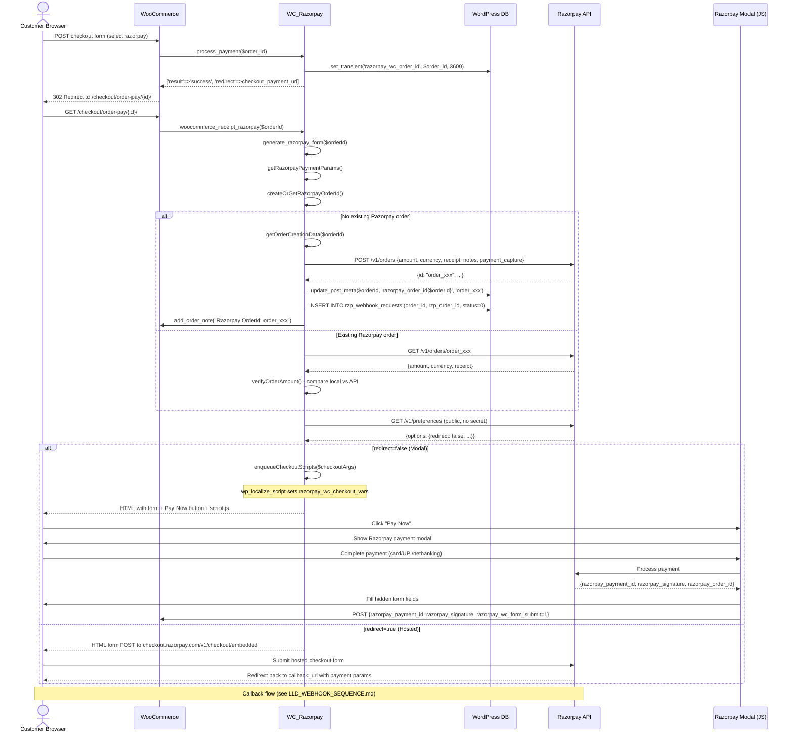
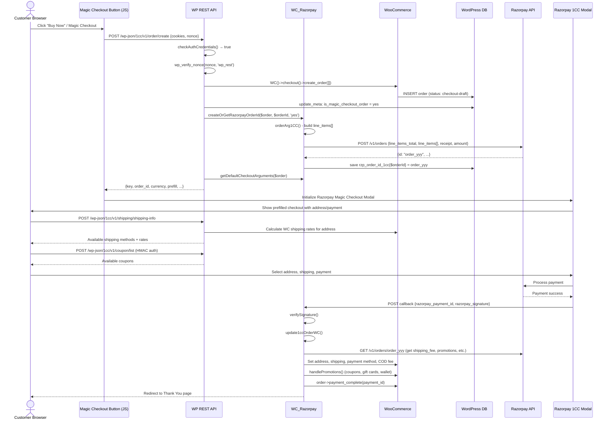

# LLD — Checkout Sequence Diagram

## Standard Checkout Sequence

```mermaid
sequenceDiagram
    actor Customer as Customer Browser
    participant WC as WooCommerce
    participant GW as WC_Razorpay
    participant DB as WordPress DB
    participant RZPAPI as Razorpay API
    participant Modal as Razorpay Modal (JS)

    Customer->>WC: POST checkout form (select razorpay)
    WC->>GW: process_payment($order_id)
    GW->>DB: set_transient('razorpay_wc_order_id', $order_id, 3600)
    GW-->>WC: ['result'=>'success', 'redirect'=>checkout_payment_url]
    WC-->>Customer: 302 Redirect to /checkout/order-pay/{id}/

    Customer->>WC: GET /checkout/order-pay/{id}/
    WC->>GW: woocommerce_receipt_razorpay($orderId)
    GW->>GW: generate_razorpay_form($orderId)
    GW->>GW: getRazorpayPaymentParams()
    GW->>GW: createOrGetRazorpayOrderId()

    alt No existing Razorpay order
        GW->>GW: getOrderCreationData($orderId)
        GW->>RZPAPI: POST /v1/orders {amount, currency, receipt, notes, payment_capture}
        RZPAPI-->>GW: {id: "order_xxx", ...}
        GW->>DB: update_post_meta($orderId, 'razorpay_order_id{$orderId}', 'order_xxx')
        GW->>DB: INSERT INTO rzp_webhook_requests (order_id, rzp_order_id, status=0)
        GW->>WC: add_order_note("Razorpay OrderId: order_xxx")
    else Existing Razorpay order
        GW->>RZPAPI: GET /v1/orders/order_xxx
        RZPAPI-->>GW: {amount, currency, receipt}
        GW->>GW: verifyOrderAmount() - compare local vs API
    end

    GW->>RZPAPI: GET /v1/preferences (public, no secret)
    RZPAPI-->>GW: {options: {redirect: false, ...}}

    alt redirect=false (Modal)
        GW->>GW: enqueueCheckoutScripts($checkoutArgs)
        Note over GW: wp_localize_script sets razorpay_wc_checkout_vars
        GW-->>Customer: HTML with form + Pay Now button + script.js

        Customer->>Modal: Click "Pay Now"
        Modal->>Customer: Show Razorpay payment modal
        Customer->>Modal: Complete payment (card/UPI/netbanking)
        Modal->>RZPAPI: Process payment
        RZPAPI-->>Modal: {razorpay_payment_id, razorpay_signature, razorpay_order_id}
        Modal->>Customer: Fill hidden form fields
        Modal->>WC: POST {razorpay_payment_id, razorpay_signature, razorpay_wc_form_submit=1}
    else redirect=true (Hosted)
        GW-->>Customer: HTML form POST to checkout.razorpay.com/v1/checkout/embedded
        Customer->>RZPAPI: Submit hosted checkout form
        RZPAPI-->>Customer: Redirect back to callback_url with payment params
    end

    Note over Customer, RZPAPI: Callback flow (see LLD_WEBHOOK_SEQUENCE.md)
```

## Magic Checkout (1CC) Sequence

```mermaid
sequenceDiagram
    actor Customer as Customer Browser
    participant BTN as Magic Checkout Button (JS)
    participant WPR as WP REST API
    participant GW as WC_Razorpay
    participant WC as WooCommerce
    participant DB as WordPress DB
    participant RZPAPI as Razorpay API
    participant Modal as Razorpay 1CC Modal

    Customer->>BTN: Click "Buy Now" / Magic Checkout
    BTN->>WPR: POST /wp-json/1cc/v1/order/create {cookies, nonce}
    WPR->>WPR: checkAuthCredentials() → true
    WPR->>WPR: wp_verify_nonce(nonce, 'wp_rest')
    WPR->>WC: WC()->checkout()->create_order([])
    WC->>DB: INSERT order (status: checkout-draft)
    WPR->>DB: update_meta: is_magic_checkout_order = yes
    WPR->>GW: createOrGetRazorpayOrderId($order, $orderId, 'yes')
    GW->>GW: orderArg1CC() - build line_items[]
    GW->>RZPAPI: POST /v1/orders {line_items_total, line_items[], receipt, amount}
    RZPAPI-->>GW: {id: "order_yyy", ...}
    GW->>DB: save rzp_order_id_1cc{$orderId} = order_yyy
    WPR->>GW: getDefaultCheckoutArguments($order)
    WPR-->>BTN: {key, order_id, currency, prefill, ...}

    BTN->>Modal: Initialize Razorpay Magic Checkout Modal
    Modal->>Customer: Show prefilled checkout with address/payment

    Customer->>WPR: POST /wp-json/1cc/v1/shipping/shipping-info
    WPR->>WC: Calculate WC shipping rates for address
    WPR-->>Customer: Available shipping methods + rates

    Customer->>WPR: POST /wp-json/1cc/v1/coupon/list (HMAC auth)
    WPR-->>Customer: Available coupons

    Customer->>Modal: Select address, shipping, payment
    Modal->>RZPAPI: Process payment
    RZPAPI-->>Modal: Payment success
    Modal->>GW: POST callback {razorpay_payment_id, razorpay_signature}
    GW->>GW: verifySignature()
    GW->>GW: update1ccOrderWC()
    GW->>RZPAPI: GET /v1/orders/order_yyy (get shipping_fee, promotions, etc.)
    GW->>WC: Set address, shipping, payment method, COD fee
    GW->>WC: handlePromotions() (coupons, gift cards, wallet)
    GW->>WC: order->payment_complete(payment_id)
    GW-->>Customer: Redirect to Thank You page
```
