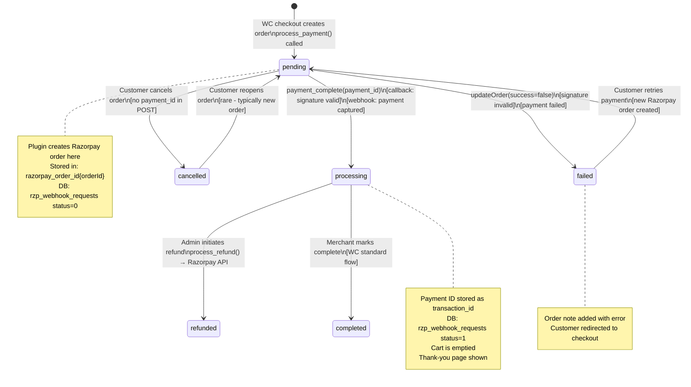
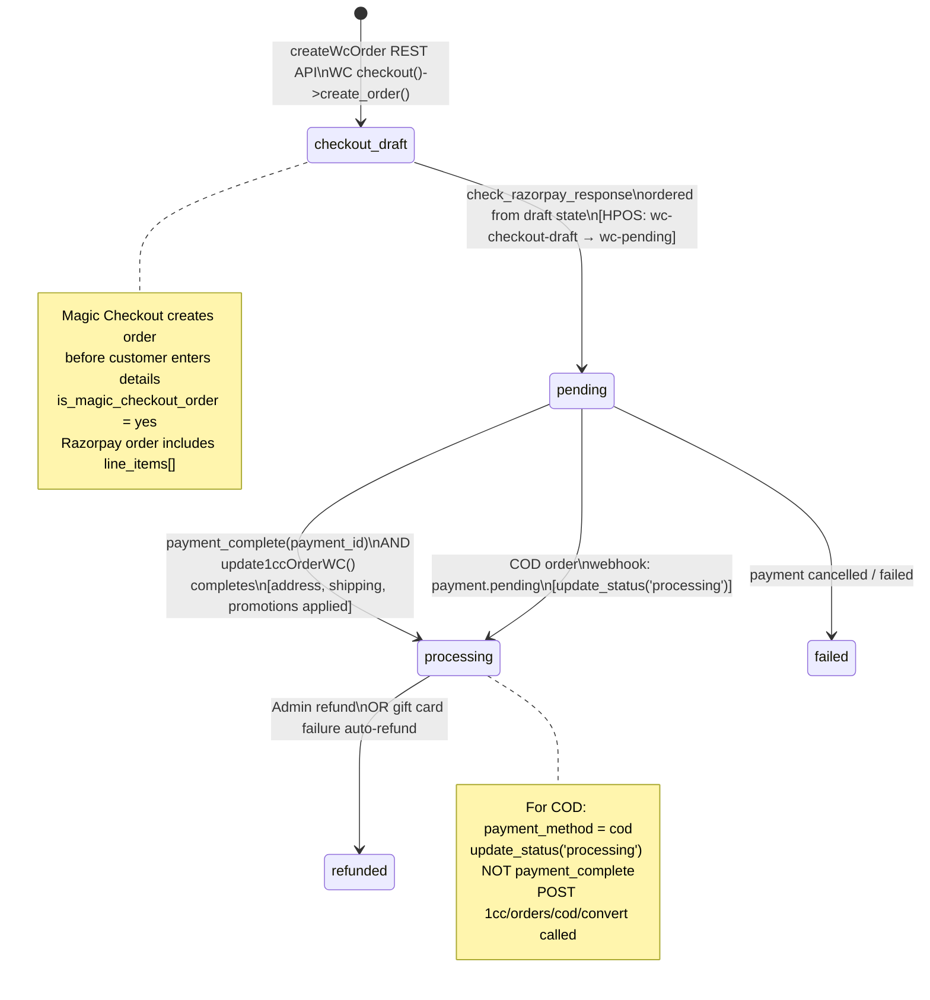
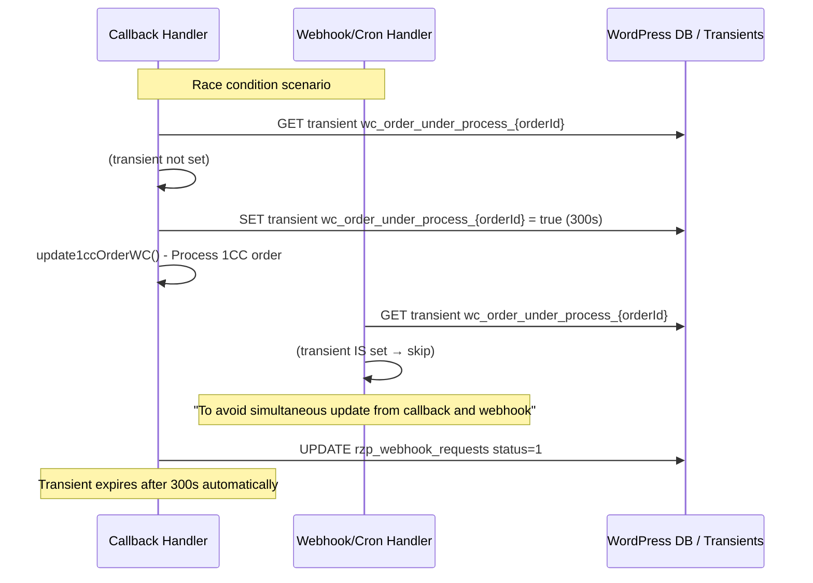

# LLD — Order State Machine Diagram

## WooCommerce Order Status Transitions (Razorpay Plugin)



## 1CC Order Status Transitions



## Order Meta State

```mermaid
flowchart TD
    A[WC Order Created] --> B{Is 1CC?}
    B -->|No| C[is_magic_checkout_order = no\nMeta key: razorpay_order_id{id}]
    B -->|Yes| D[is_magic_checkout_order = yes\nMeta key: razorpay_order_id_1cc{id}]

    C --> E[Razorpay Order Created]
    D --> E

    E --> F[Meta: razorpay_order_id{id} = order_xxx\nDB: rzp_webhook_requests status=0\nNote: Razorpay OrderId: order_xxx]

    F --> G{Payment Outcome}
    G -->|Callback Success| H[Meta: _transaction_id = pay_xxx\nDB: rzp_webhook_requests status=1\nNote: payment successful]
    G -->|Webhook Success| I[Meta: _transaction_id = pay_xxx\nDB: rzp_webhook_requests status=0 stays\nNote: processed through webhook]
    G -->|Failure| J[Note: Transaction Failed\nStatus: failed]

    H --> K[Cart cleared\nRedirect to thank-you]
    I --> K
```

## Concurrent Processing Prevention


