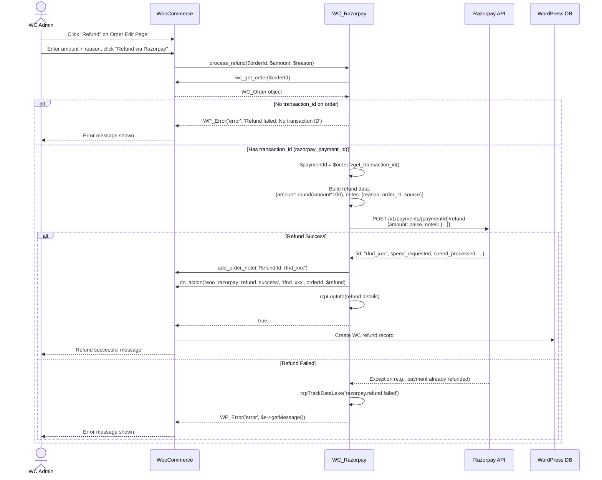
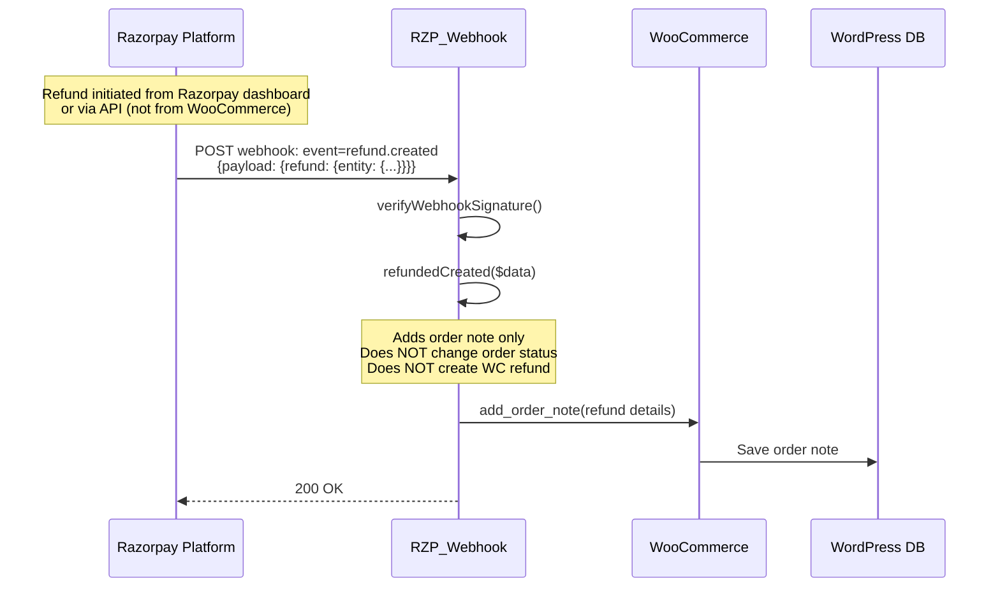

# LLD — Refund Sequence Diagram

## Standard Refund Sequence (Admin-Initiated)



## Gift Card Refund Sequence (Programmatic)

```mermaid
sequenceDiagram
    participant GW as WC_Razorpay
    participant GC as Gift Card Plugin (YITH/PW)
    participant RZPAPI as Razorpay API
    participant WC as WooCommerce
    participant DB as WordPress DB
    actor Customer as Customer Browser

    Note over GW: Called during update1ccOrderWC()<br/>when gift card deduction fails

    GW->>GC: Check gift card balance / status
    GC-->>GW: Insufficient balance / card invalid

    GW->>GW: processRefundForOrdersWithGiftCard(orderId, paymentId, amount, reason)
    GW->>RZPAPI: POST /v1/payments/{paymentId}/refund<br/>{amount: paise_amount, notes: {...}}
    RZPAPI-->>GW: {id: "rfnd_yyy", ...}
    GW->>WC: wc_create_refund({amount, reason, order_id, refund_id, refund_payment: false})
    WC->>DB: Create WC refund record
    GW->>WC: add_order_note("Refund Id: rfnd_yyy")
    GW->>GW: add_notice("Payment refunded", "error")
    GW-->>Customer: wp_redirect(wc_get_cart_url())
    Note over GW: exit; — stops further execution
```

## Refund via `refund.created` Webhook


