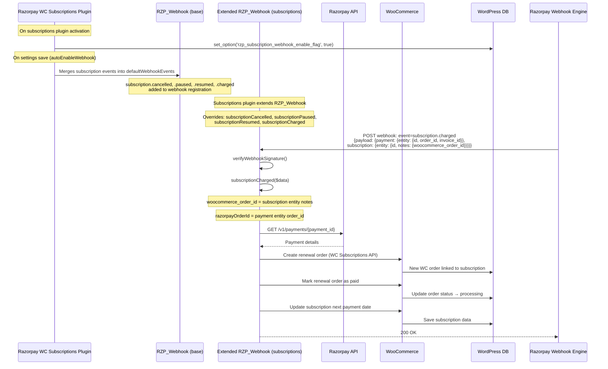
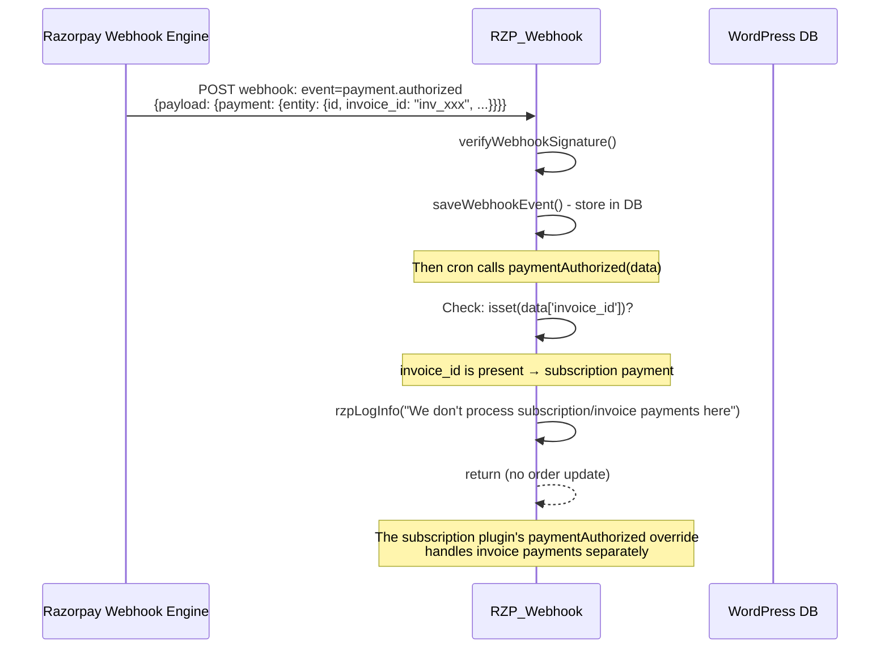
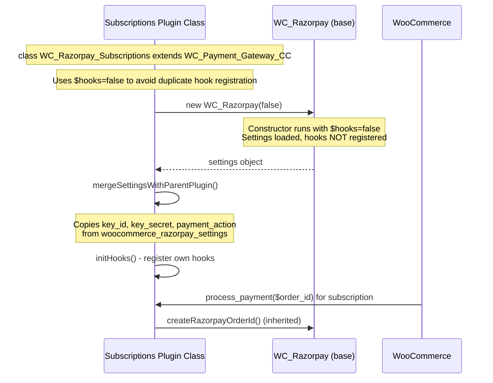

# LLD — Subscription Sequence Diagram

## Base Plugin Subscription Architecture

```mermaid
sequenceDiagram
    participant SubPlugin as Razorpay WC Subscriptions Plugin
    participant BaseWH as RZP_Webhook (base)
    participant ExtWH as Extended RZP_Webhook (subscriptions)
    participant RZPAPI as Razorpay API
    participant WC as WooCommerce
    participant DB as WordPress DB

    Note over SubPlugin: On subscriptions plugin activation
    SubPlugin->>DB: set_option('rzp_subscription_webhook_enable_flag', true)

    Note over SubPlugin: On settings save (autoEnableWebhook)
    SubPlugin->>BaseWH: Merges subscription events into defaultWebhookEvents
    Note over BaseWH: subscription.cancelled, .paused, .resumed, .charged<br/>added to webhook registration

    Note over ExtWH: Subscriptions plugin extends RZP_Webhook
    Note over ExtWH: Overrides: subscriptionCancelled, subscriptionPaused,<br/>subscriptionResumed, subscriptionCharged

    participant RZPEngine as Razorpay Webhook Engine

    RZPEngine->>ExtWH: POST webhook: event=subscription.charged<br/>{payload: {payment: {entity: {id, order_id, invoice_id}},<br/>subscription: {entity: {id, notes: {woocommerce_order_id}}}}}

    ExtWH->>ExtWH: verifyWebhookSignature()
    ExtWH->>ExtWH: subscriptionCharged($data)
    Note over ExtWH: woocommerce_order_id = subscription entity notes
    Note over ExtWH: razorpayOrderId = payment entity order_id

    ExtWH->>RZPAPI: GET /v1/payments/{payment_id}
    RZPAPI-->>ExtWH: Payment details

    ExtWH->>WC: Create renewal order (WC Subscriptions API)
    WC->>DB: New WC order linked to subscription

    ExtWH->>WC: Mark renewal order as paid
    WC->>DB: Update order status → processing

    ExtWH->>WC: Update subscription next payment date
    WC->>DB: Save subscription data

    ExtWH-->>RZPEngine: 200 OK
```

## `payment.authorized` with Invoice ID (Subscription Payment)

```mermaid
sequenceDiagram
    participant RZPEngine as Razorpay Webhook Engine
    participant WH as RZP_Webhook
    participant DB as WordPress DB

    RZPEngine->>WH: POST webhook: event=payment.authorized<br/>{payload: {payment: {entity: {id, invoice_id: "inv_xxx", ...}}}}

    WH->>WH: verifyWebhookSignature()
    WH->>WH: saveWebhookEvent() - store in DB

    Note over WH: Then cron calls paymentAuthorized(data)

    WH->>WH: Check: isset(data['invoice_id'])?
    Note over WH: invoice_id is present → subscription payment
    WH->>WH: rzpLogInfo("We don't process subscription/invoice payments here")
    WH-->>WH: return (no order update)

    Note over WH: The subscription plugin's paymentAuthorized override<br/>handles invoice payments separately
```

## Subscription Settings Merge Pattern

```mermaid
sequenceDiagram
    participant SubPlugin as Subscriptions Plugin Class
    participant BaseGW as WC_Razorpay (base)
    participant WC as WooCommerce

    Note over SubPlugin: class WC_Razorpay_Subscriptions extends WC_Payment_Gateway_CC
    Note over SubPlugin: Uses $hooks=false to avoid duplicate hook registration

    SubPlugin->>BaseGW: new WC_Razorpay(false)
    Note over BaseGW: Constructor runs with $hooks=false<br/>Settings loaded, hooks NOT registered
    BaseGW-->>SubPlugin: settings object

    SubPlugin->>SubPlugin: mergeSettingsWithParentPlugin()
    Note over SubPlugin: Copies key_id, key_secret, payment_action<br/>from woocommerce_razorpay_settings
    SubPlugin->>SubPlugin: initHooks() - register own hooks

    WC->>SubPlugin: process_payment($order_id) for subscription
    SubPlugin->>BaseGW: createRazorpayOrderId() (inherited)
```
