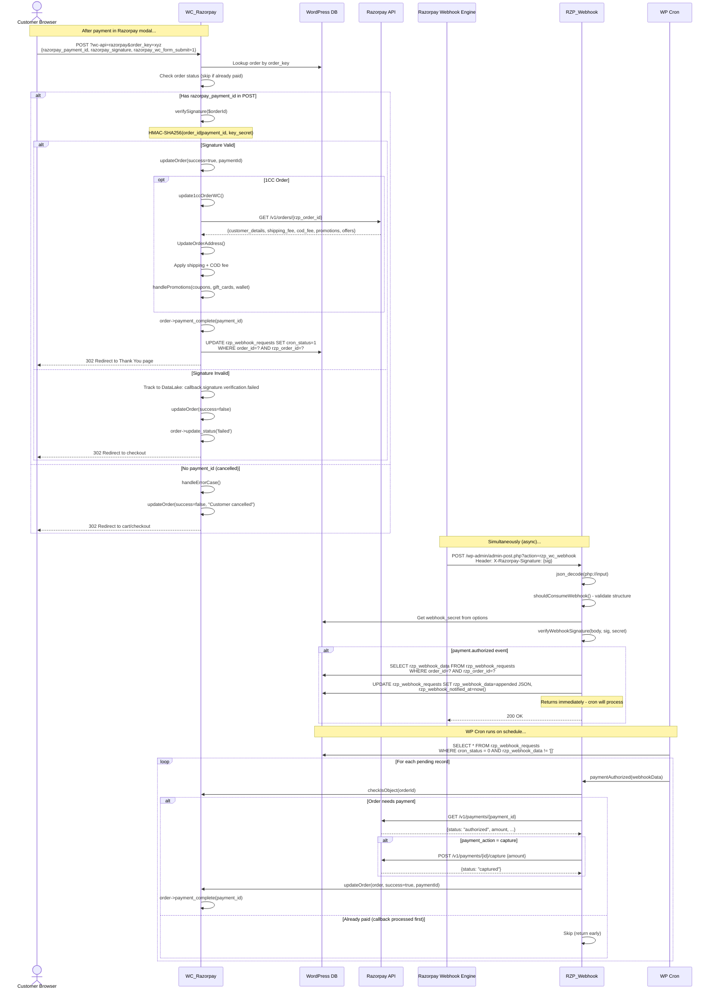
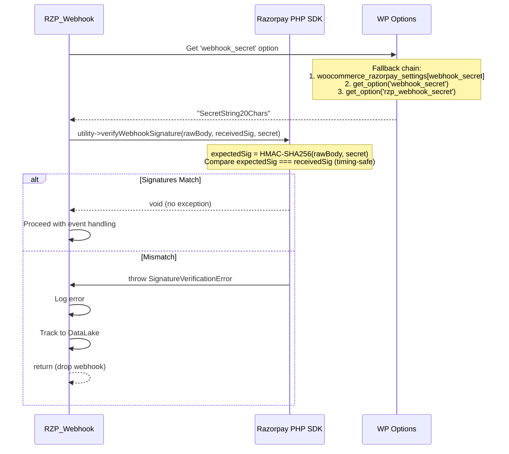

# LLD — Webhook Sequence Diagram

## Payment Callback + Webhook Processing Sequence

```mermaid
sequenceDiagram
    actor Customer as Customer Browser
    participant GW as WC_Razorpay
    participant DB as WordPress DB
    participant RZPAPI as Razorpay API
    participant RZPEngine as Razorpay Webhook Engine
    participant WH as RZP_Webhook
    participant CRON as WP Cron

    Note over Customer, GW: After payment in Razorpay modal...

    Customer->>GW: POST ?wc-api=razorpay&order_key=xyz<br/>{razorpay_payment_id, razorpay_signature, razorpay_wc_form_submit=1}
    GW->>DB: Lookup order by order_key
    GW->>GW: Check order status (skip if already paid)
    
    alt Has razorpay_payment_id in POST
        GW->>GW: verifySignature($orderId)
        Note over GW: HMAC-SHA256(order_id|payment_id, key_secret)
        
        alt Signature Valid
            GW->>GW: updateOrder(success=true, paymentId)
            
            opt 1CC Order
                GW->>GW: update1ccOrderWC()
                GW->>RZPAPI: GET /v1/orders/{rzp_order_id}
                RZPAPI-->>GW: {customer_details, shipping_fee, cod_fee, promotions, offers}
                GW->>GW: UpdateOrderAddress()
                GW->>GW: Apply shipping + COD fee
                GW->>GW: handlePromotions(coupons, gift_cards, wallet)
            end
            
            GW->>GW: order->payment_complete(payment_id)
            GW->>DB: UPDATE rzp_webhook_requests SET cron_status=1<br/>WHERE order_id=? AND rzp_order_id=?
            GW-->>Customer: 302 Redirect to Thank You page
        else Signature Invalid
            GW->>GW: Track to DataLake: callback.signature.verification.failed
            GW->>GW: updateOrder(success=false)
            GW->>GW: order->update_status('failed')
            GW-->>Customer: 302 Redirect to checkout
        end
    else No payment_id (cancelled)
        GW->>GW: handleErrorCase()
        GW->>GW: updateOrder(success=false, "Customer cancelled")
        GW-->>Customer: 302 Redirect to cart/checkout
    end

    Note over RZPEngine, WH: Simultaneously (async)...

    RZPEngine->>WH: POST /wp-admin/admin-post.php?action=rzp_wc_webhook<br/>Header: X-Razorpay-Signature: {sig}
    WH->>WH: json_decode(php://input)
    WH->>WH: shouldConsumeWebhook() - validate structure
    WH->>DB: Get webhook_secret from options
    WH->>WH: verifyWebhookSignature(body, sig, secret)
    
    alt payment.authorized event
        WH->>DB: SELECT rzp_webhook_data FROM rzp_webhook_requests<br/>WHERE order_id=? AND rzp_order_id=?
        WH->>DB: UPDATE rzp_webhook_requests SET rzp_webhook_data=appended JSON,<br/>rzp_webhook_notified_at=now()
        Note over WH: Returns immediately - cron will process
        WH-->>RZPEngine: 200 OK
    end

    Note over CRON, DB: WP Cron runs on schedule...

    CRON->>DB: SELECT * FROM rzp_webhook_requests<br/>WHERE cron_status = 0 AND rzp_webhook_data != '[]'
    
    loop For each pending record
        CRON->>WH: paymentAuthorized(webhookData)
        WH->>GW: checkIsObject(orderId)
        
        alt Order needs payment
            WH->>RZPAPI: GET /v1/payments/{payment_id}
            RZPAPI-->>WH: {status: "authorized", amount, ...}
            
            alt payment_action = capture
                WH->>RZPAPI: POST /v1/payments/{id}/capture {amount}
                RZPAPI-->>WH: {status: "captured"}
            end
            
            WH->>GW: updateOrder(order, success=true, paymentId)
            GW->>GW: order->payment_complete(payment_id)
        else Already paid (callback processed first)
            WH->>WH: Skip (return early)
        end
    end
```

## Webhook Signature Verification Detail

```mermaid
sequenceDiagram
    participant WH as RZP_Webhook
    participant SDK as Razorpay PHP SDK
    participant DB as WP Options

    WH->>DB: Get 'webhook_secret' option
    Note over DB: Fallback chain:<br/>1. woocommerce_razorpay_settings[webhook_secret]<br/>2. get_option('webhook_secret')<br/>3. get_option('rzp_webhook_secret')
    DB-->>WH: "SecretString20Chars"

    WH->>SDK: utility->verifyWebhookSignature(rawBody, receivedSig, secret)
    Note over SDK: expectedSig = HMAC-SHA256(rawBody, secret)<br/>Compare expectedSig === receivedSig (timing-safe)
    
    alt Signatures Match
        SDK-->>WH: void (no exception)
        WH->>WH: Proceed with event handling
    else Mismatch
        SDK->>WH: throw SignatureVerificationError
        WH->>WH: Log error
        WH->>WH: Track to DataLake
        WH-->>WH: return (drop webhook)
    end
```
