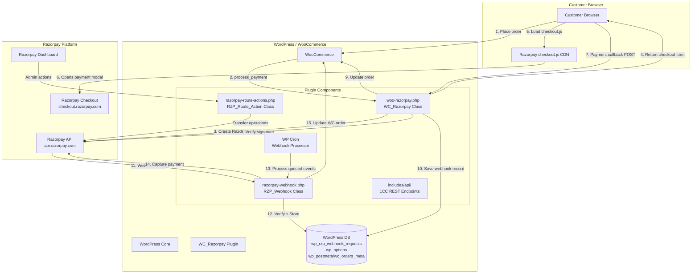
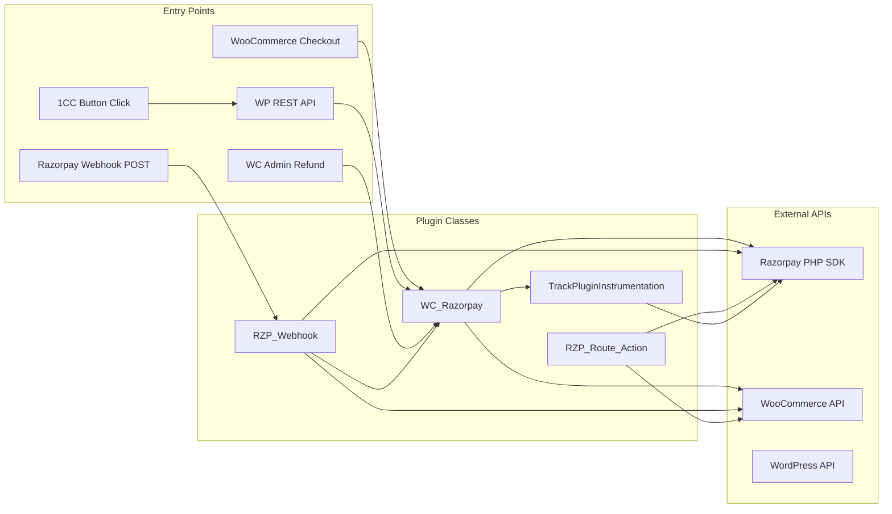
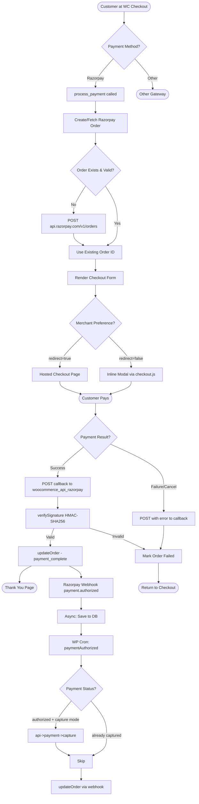
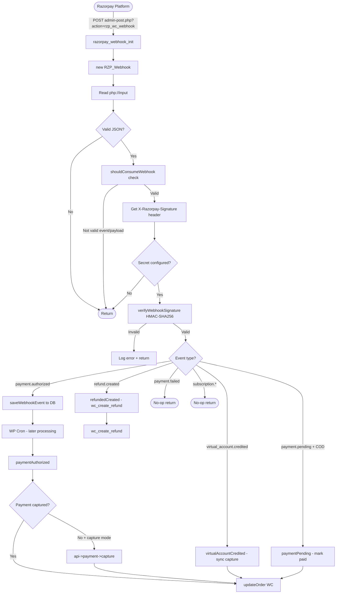
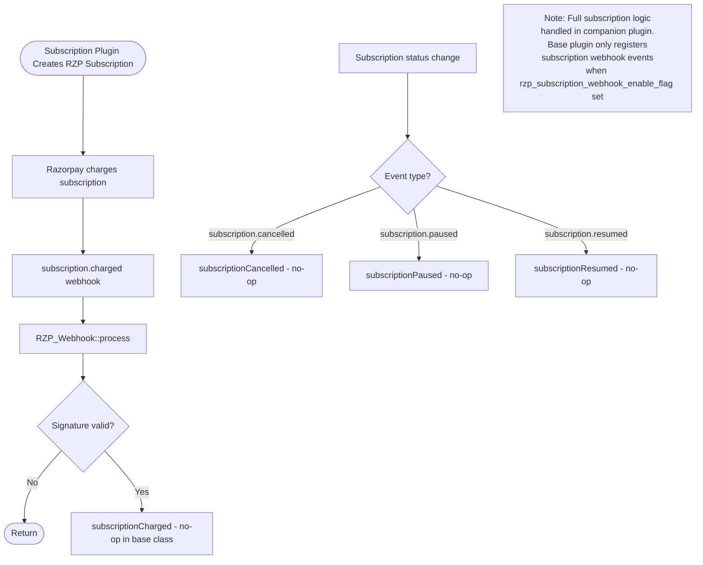
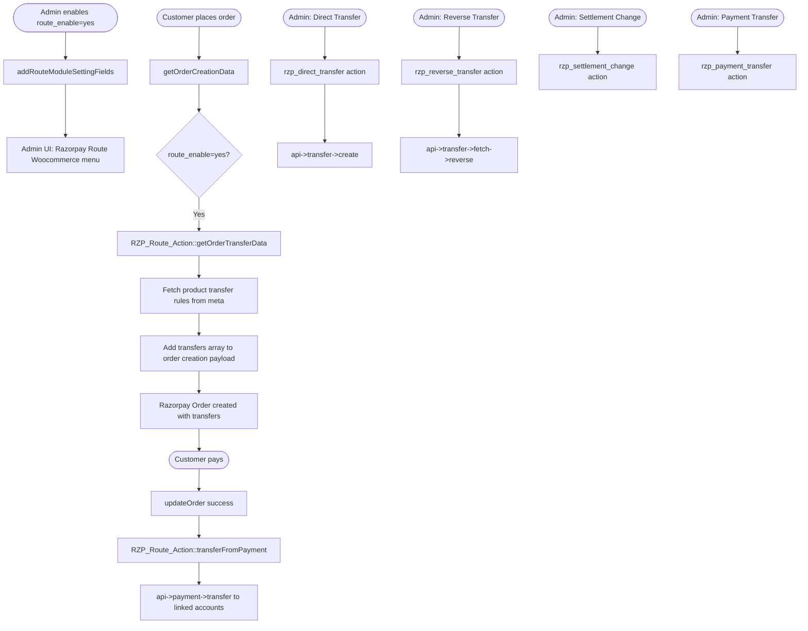

# High Level Design (HLD) - Razorpay WooCommerce Plugin

## 1. System Architecture Overview



---

## 2. Component Interaction Diagram



---

## 3. Payment Flow HLD



---

## 4. Webhook Flow HLD



---

## 5. Subscription Flow HLD



---

## 6. Route Transfer HLD



---

## 7. Magic Checkout (1CC) Flow HLD

```mermaid
graph TD
    A([Customer on Product/Cart Page]) --> B{is1ccEnabled?}
    B -->|No| Z([Standard Checkout])
    B -->|Yes| C[Show Magic Checkout Button]

    C --> D[Customer clicks 1CC button]
    D --> E[btn-1cc-checkout.js fires]
    E --> F[POST /wp-json/1cc/v1/order/create]

    F --> G[checkAuthCredentials]
    G --> H[createWcOrder handler]
    H --> I[WC()->checkout()->create_order]
    I --> J[Set status: checkout-draft]
    J --> K[Set is_magic_checkout_order=yes]
    K --> L[Remove default shipping]
    L --> M[Return orderId + rzpOrderId]

    M --> N[Razorpay fetches shipping options]
    N --> O[POST /wp-json/1cc/v1/shipping/shipping-info]
    O --> P[calculateShipping1cc]
    P --> Q[Build cart from WC order]
    Q --> R[Calculate WC shipping rates]
    R --> S[Return shipping options + costs]

    S --> T[Customer fills address + pays]
    T --> U[Razorpay processes payment]
    U --> V[Payment callback to woocommerce_api_razorpay]

    V --> W[check_razorpay_response]
    W --> X[verifySignature]
    X --> Y{is_magic_checkout_order?}
    Y -->|Yes| Z2[update1ccOrderWC]
    Y -->|No| Z3[Standard updateOrder]

    Z2 --> AA[UpdateOrderAddress from RZP order]
    AA --> AB[Apply shipping fees]
    AB --> AC[Handle COD fee if applicable]
    AC --> AD[handlePromotions - coupons, giftcards]
    AD --> AE[payment_complete]
    AE --> AF([Thank You Page])
    Z3 --> AF
```
