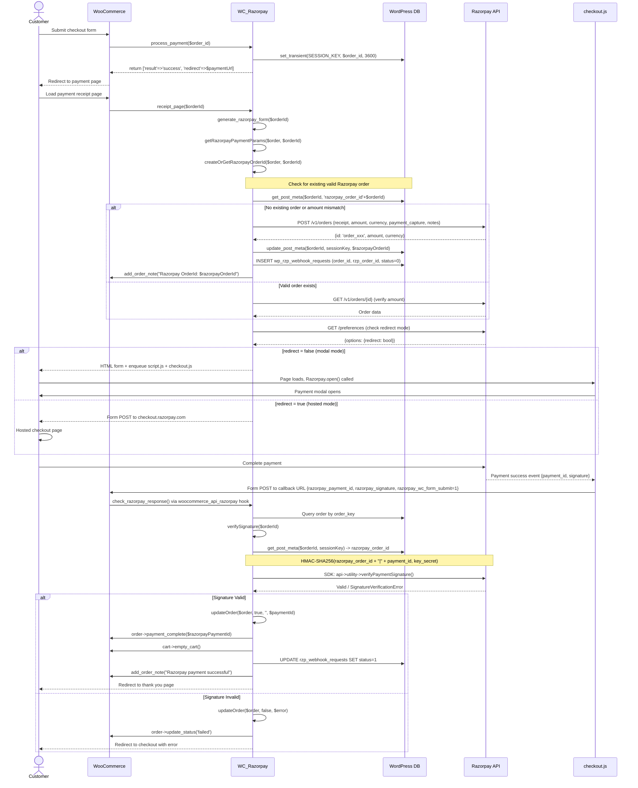
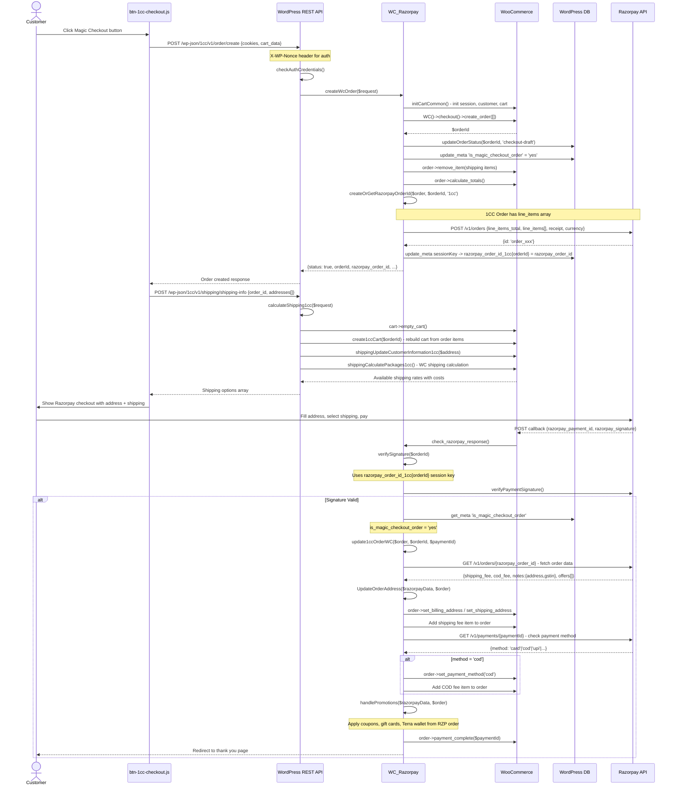
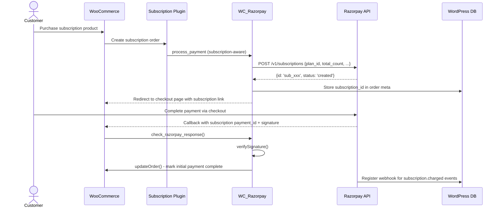
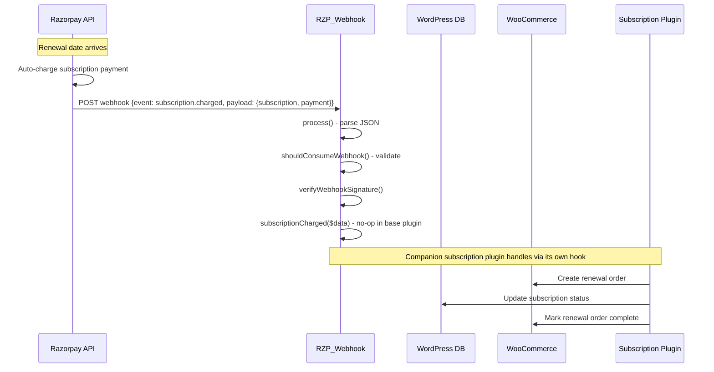
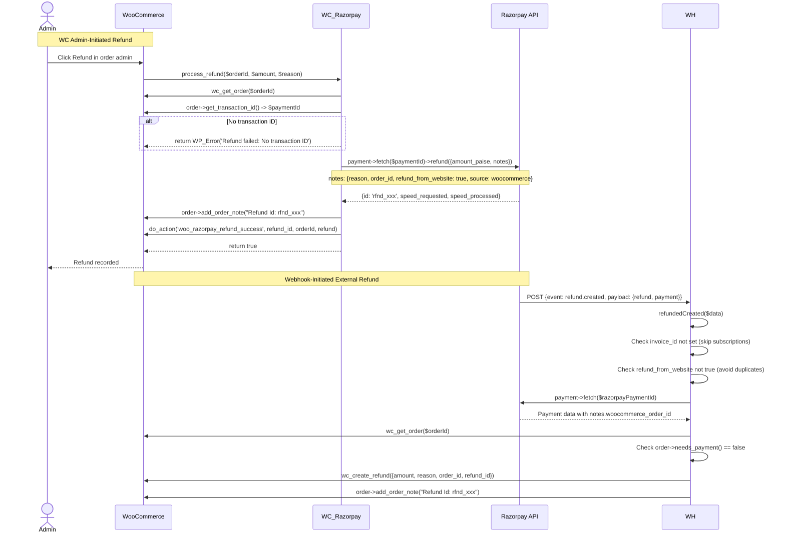
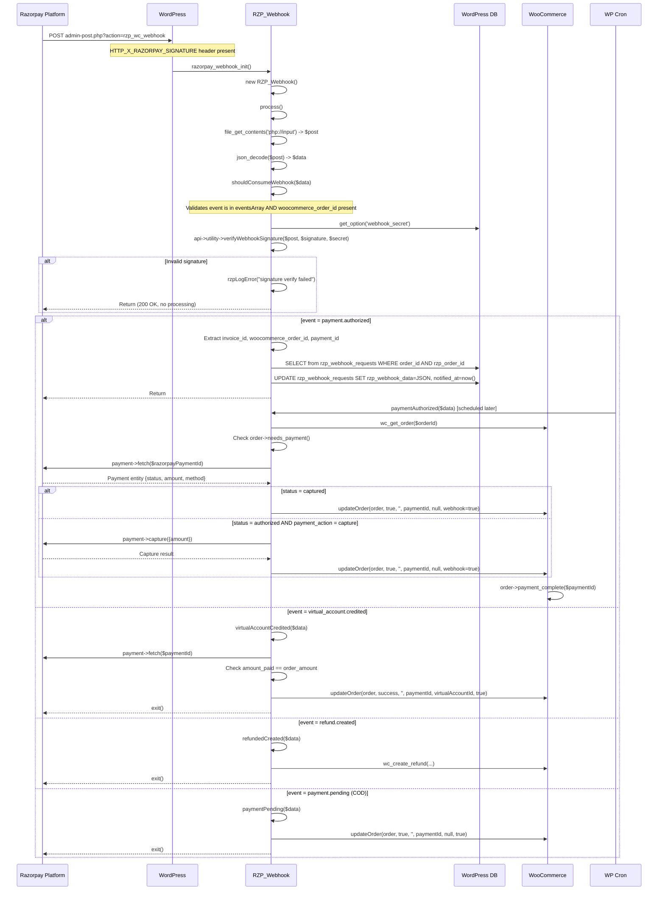
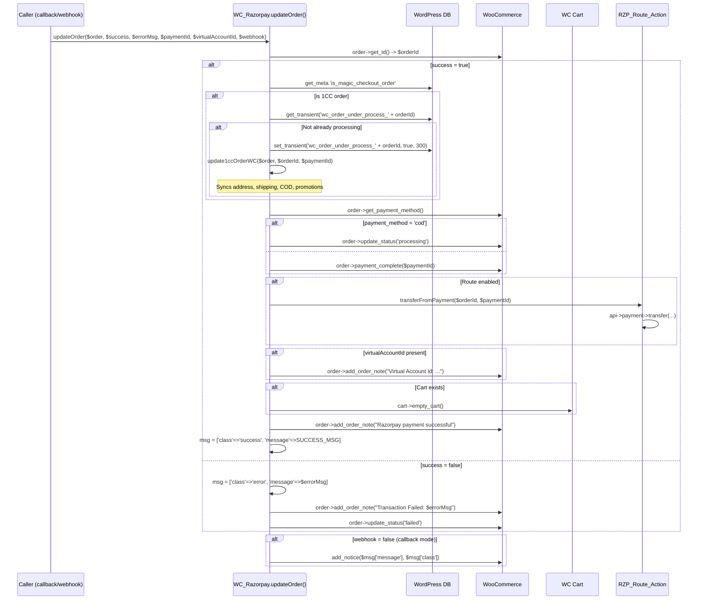

# Low Level Design (LLD) - Razorpay WooCommerce Plugin

## 1. Standard Payment Flow - Sequence Diagram

---

## 2. Razorpay Route / Magic Checkout (1CC) Flow - Sequence Diagram

---

## 3. Subscription Creation Flow - Sequence Diagram

---

## 4. Subscription Renewal Flow - Sequence Diagram

---

## 5. Refund Flow - Sequence Diagram

---

## 6. Webhook Processing - Sequence Diagram

---

## 7. Order Status Update Flow - Sequence Diagram

