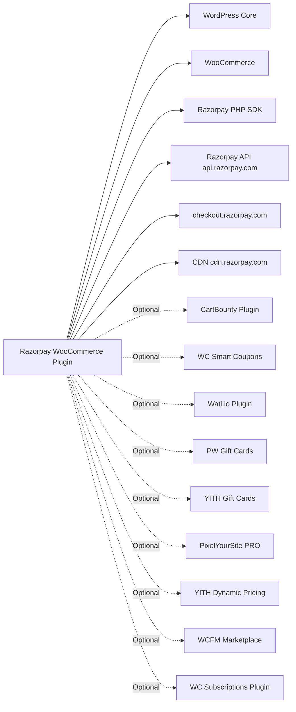

# Codebase Map - Razorpay WooCommerce Plugin

Complete map of all files, their purposes, key functions, and relationships.

---

## Root Level Files

| File | Purpose | Key Contents |
|------|---------|-------------|
| `woo-razorpay.php` | **Main plugin file** | `WC_Razorpay` class, plugin bootstrap, hook registration |
| `checkout-block.php` | Gutenberg block support | `WC_Razorpay_Blocks` class |
| `script.js` | Frontend checkout JS | Opens Razorpay modal, handles payment callbacks |
| `btn-1cc-checkout.js` | Magic Checkout button | 1CC button logic, REST API calls to order/create |
| `checkout_block.js` | Block editor checkout | Block-based checkout integration |
| `composer.json` | PHP dependencies | Autoloading, dev dependencies |
| `composer.wp-install.json` | WP plugin composer | WordPress-specific install config |
| `phpunit.xml` | Test configuration | PHPUnit test suite setup |
| `readme.txt` | WordPress.org listing | Plugin description, changelog |
| `release.sh` | Release automation | Build and release script |
| `debug.md` | Debug notes | Developer notes for debugging |

---

## `includes/` Directory

### Core Files

#### `woo-razorpay.php` (Main Class: `WC_Razorpay`)

**Constants:**
```
SESSION_KEY = 'razorpay_wc_order_id'
RAZORPAY_PAYMENT_ID = 'razorpay_payment_id'
RAZORPAY_ORDER_ID = 'razorpay_order_id'
RAZORPAY_ORDER_ID_1CC = 'razorpay_order_id_1cc'
RAZORPAY_SIGNATURE = 'razorpay_signature'
RAZORPAY_WC_FORM_SUBMIT = 'razorpay_wc_form_submit'
INR = 'INR'
CAPTURE = 'capture'
AUTHORIZE = 'authorize'
WC_ORDER_ID = 'woocommerce_order_id'
WC_ORDER_NUMBER = 'woocommerce_order_number'
DEFAULT_LABEL = 'UPI, Cards, NetBanking'
DEFAULT_DESCRIPTION = '...'
DEFAULT_SUCCESS_MESSAGE = '...'
PREPAY_COD_URL = '1cc/orders/cod/convert'
ONE_CC_MERCHANT_PREF = 'one_cc_merchant_preference'
RZP_ORDER_CREATED = 0
RZP_ORDER_PROCESSED_BY_CALLBACK = 1
RZP_INTEGRATION = 'woocommerce'
```

**Key Methods:**
| Method | Purpose |
|--------|---------|
| `__construct($hooks)` | Init settings, optionally bind hooks |
| `initHooks()` | Register all WP/WC hooks |
| `init_form_fields()` | Define admin settings fields |
| `process_payment($order_id)` | Entry point: redirect to payment page |
| `receipt_page($orderId)` | Render payment form |
| `generate_razorpay_form($orderId)` | Generate HTML checkout form |
| `generateOrderForm($data)` | Inner form generation |
| `check_razorpay_response()` | Handle payment callback |
| `verifySignature($orderId)` | HMAC signature verification |
| `updateOrder(&$order, $success, ...)` | Mark order paid/failed |
| `update1ccOrderWC(&$order, ...)` | Sync 1CC order data |
| `UpdateOrderAddress($razorpayData, $order)` | Sync address from RZP |
| `createOrGetRazorpayOrderId(...)` | Create/fetch RZP order |
| `createRazorpayOrderId($orderId, $sessionKey)` | Call Razorpay API to create order |
| `verifyOrderAmount($razorpayOrderId, ...)` | Validate amount hasn't changed |
| `getOrderCreationData($orderId)` | Build order payload for Razorpay |
| `orderArg1CC($data, $order)` | Add line_items for 1CC orders |
| `process_refund($orderId, $amount, $reason)` | WC refund handler |
| `processRefundForOrdersWithGiftCard(...)` | Refund with gift card |
| `autoEnableWebhook()` | Auto-register webhook with Razorpay |
| `webhookAPI($method, $url, $data)` | Call Razorpay webhook CRUD API |
| `generateSecret()` | Generate 20-char random secret |
| `registerRzp1ccSigningSecret($keyId, $keySec)` | Register 1CC HMAC secret |
| `getRazorpayApiInstance($key, $secret)` | Get Razorpay SDK instance |
| `getRazorpayApiPublicInstance()` | Get SDK with public key only |
| `getDefaultCheckoutArguments($order)` | Build checkout JS args |
| `getCheckoutArguments($order, $params)` | Merge checkout args |
| `getCustomerInfo($order)` | Get customer name/email/phone |
| `getSetting($key)` | Get plugin setting by key |
| `handlePromotions($razorpayData, $order, ...)` | Apply coupons/giftcards |
| `enqueue_checkout_js_script_on_checkout()` | Enqueue checkout.js |
| `enqueueCheckoutScripts($data)` | Enqueue + localize scripts |
| `newTrackPluginInstrumentation($key, $secret)` | Get analytics instance |
| `pluginInstrumentation()` | Track settings save event |
| `getVersionMetaInfo($data)` | SDK version metadata |

---

#### `includes/razorpay-webhook.php` (Class: `RZP_Webhook`)

**Event Constants:**
```
PAYMENT_AUTHORIZED = 'payment.authorized'
PAYMENT_FAILED = 'payment.failed'
PAYMENT_PENDING = 'payment.pending'
SUBSCRIPTION_CANCELLED = 'subscription.cancelled'
REFUNDED_CREATED = 'refund.created'
VIRTUAL_ACCOUNT_CREDITED = 'virtual_account.credited'
SUBSCRIPTION_PAUSED = 'subscription.paused'
SUBSCRIPTION_RESUMED = 'subscription.resumed'
SUBSCRIPTION_CHARGED = 'subscription.charged'
```

**Key Methods:**
| Method | Purpose |
|--------|---------|
| `process()` | Main webhook processing entry point |
| `shouldConsumeWebhook($data)` | Validate webhook data structure |
| `saveWebhookEvent($data, $rzpOrderId)` | Store event in DB |
| `paymentAuthorized($data)` | Process payment authorized event (cron) |
| `paymentFailed($data)` | No-op |
| `paymentPending($data)` | Handle COD pending payment |
| `virtualAccountCredited($data)` | Handle bank transfer payment |
| `refundedCreated($data)` | Sync external refund to WC |
| `subscriptionCharged($data)` | No-op (companion plugin) |
| `subscriptionCancelled($data)` | No-op |
| `subscriptionPaused($data)` | No-op |
| `subscriptionResumed($data)` | No-op |
| `getPaymentEntity($paymentId, $data)` | Fetch payment from Razorpay API |
| `getOrderAmountAsInteger($order)` | Get order total in paise |
| `checkIsObject($orderId)` | Safely get WC order object |

---

#### `includes/razorpay-route.php` (Class: `RZP_Route`)

**Functions (non-class):**
- `addRouteModuleSettingFields(&$defaultFormFields)` - Add route settings
- `razorpayRouteModule()` - Activate route module if enabled
- `rzpAddPluginPage()` - Register admin menu pages
- Various page rendering functions for route admin UI

**Class Methods (WP_List_Table subclass):**
| Method | Purpose |
|--------|---------|
| `rzpTransfers()` | Render transfers list page |
| `checkDirectTransferFeature()` | Check if direct transfers available |
| `prepareItems()` | Load table data |
| `column_default($item, $column)` | Render table column |

---

#### `includes/razorpay-route-actions.php` (Class: `RZP_Route_Action`)

| Method | Purpose |
|--------|---------|
| `directTransfer()` | Process direct transfer form |
| `reverseTransfer()` | Process reversal form |
| `updateTransferSettlement()` | Update settlement on_hold |
| `createPaymentTransfer()` | Create transfer from payment |
| `getOrderTransferData($orderId)` | Get product transfer rules |
| `transferFromPayment($orderId, $paymentId)` | Execute post-payment transfers |
| `authorizeAndAuthenticate($nonce, $action)` | Verify user can perform operation |

---

#### `includes/utils.php` (Global functions)

| Function | Purpose |
|----------|---------|
| `isRazorpayPluginEnabled()` | Check if gateway is enabled |
| `isTestModeEnabled()` | Check 1CC test mode |
| `is1ccEnabled()` | Check Magic Checkout enabled |
| `isDebugModeEnabled()` | Check debug mode |
| `isPdpCheckoutEnabled()` | Check product page button |
| `isMiniCartCheckoutEnabled()` | Check mini cart button |
| `isMandatoryAccCreationEnabled()` | Check mandatory account creation |
| `validateInput($route, $param)` | Validate REST API input |
| `isHposEnabled()` | Check HPOS storage mode |
| `updateOrderStatus($orderId, $status)` | Update WC order status (HPOS-aware) |

---

#### `includes/debug.php`

| Function | Purpose |
|----------|---------|
| `rzpLogInfo($message)` | Log info with WC logger |
| `rzpLogError($message)` | Log error with WC logger |
| `rzpLogDebug($message)` | Log debug (only when debug mode on) |

---

#### `includes/state-map.php`

Contains `$stateMap` array mapping India state codes (e.g., `'MH'`) to full state names (e.g., `'Maharashtra'`). Used for address normalization in 1CC order sync.

---

#### `includes/plugin-instrumentation.php` (Class: `TrackPluginInstrumentation`)

| Method | Purpose |
|--------|---------|
| `rzpTrackSegment($event, $properties)` | Track to Segment analytics |
| `rzpTrackDataLake($event, $properties)` | Track to Razorpay data lake |

---

### `includes/api/` Directory

#### `api.php` - REST Route Registration

Registers all 1CC REST endpoints. Called on `rest_api_init` hook.

**Routes registered:**
- `POST 1cc/v1/coupon/list` → `getCouponList` (HMAC auth)
- `POST 1cc/v1/coupon/apply` → `applyCouponOnCart` (credentials)
- `POST 1cc/v1/order/create` → `createWcOrder` (credentials)
- `POST 1cc/v1/shipping/shipping-info` → `calculateShipping1cc` (credentials)
- `POST 1cc/v1/abandoned-cart` → `saveCartAbandonmentData` (credentials)
- `POST 1cc/v1/cart/fetch-cart` → `fetchCartData` (credentials)
- `POST 1cc/v1/cart/create-cart` → `createCartData` (credentials)
- `POST 1cc/v1/giftcard/apply` → `validateGiftCardData` (credentials)
- `POST 1cc/v1/cod/order/prepay` → `prepayCODOrder` (credentials)

**Helper functions:**
- `initCustomerSessionAndCart()` - Init WC session for REST context
- `initCartCommon()` - Core session/customer/cart init
- `addMagicCheckoutSettingFields()` - Register 1CC admin fields

---

#### `auth.php` - Authentication

| Function | Auth Method | Purpose |
|----------|-------------|---------|
| `checkAuthCredentials()` | None (returns true) | Placeholder - WP nonce used instead |
| `checkHmacSignature($request)` | HMAC-SHA256 | Validates X-Razorpay-Signature header against `rzp1cc_hmac_secret` |

---

#### `order.php` - 1CC Order Creation

**Main function: `createWcOrder(WP_REST_Request $request)`**
- Verifies nonce
- Inits cart/session
- Creates WC order via `WC()->checkout()->create_order()`
- Sets draft status and `is_magic_checkout_order=yes`
- Handles plugin integrations (PixelYourSite, YITH Dynamic Pricing)
- Removes default shipping and coupons
- Checks minimum cart amount
- Returns order ID and Razorpay order ID

---

#### `shipping-info.php` - Shipping Calculation

**Main function: `calculateShipping1cc(WP_REST_Request $request)`**
- Validates order_id and addresses
- Rebuilds cart from WC order items
- For each address: updates customer location, calculates WC shipping
- Returns array of shipping options with prices

**Helper functions:**
- `create1ccCart($orderId)` - Rebuild WC cart from order
- `shippingUpdateCustomerInformation1cc($address)` - Set customer location
- `shippingCalculatePackages1cc(...)` - Calculate WC shipping packages

---

#### `coupon-apply.php`

**Main function: `applyCouponOnCart(WP_REST_Request $request)`**
- Validates coupon code and order_id
- Applies coupon to WC cart
- Validates order total after application
- Returns discount amount and new totals

---

#### `coupon-get.php`

**Main function: `getCouponList(WP_REST_Request $request)`**
- Gets applicable coupons for current cart/order
- Returns array of available coupons with discount amounts

---

#### `giftcard-apply.php`

**Main function: `validateGiftCardData(WP_REST_Request $request)`**
- Validates gift card code
- Checks balance and applicability
- Returns gift card value and remaining balance

---

#### `prepay-cod.php`

**Main function: `prepayCODOrder(WP_REST_Request $request)`**
- Converts a COD order to prepay via Razorpay
- Calls Razorpay internal API `1cc/orders/cod/convert`

---

#### `cart.php`

| Function | Purpose |
|----------|---------|
| `fetchCartData($request)` | Get current WC cart contents |
| `createCartData($request)` | Create/update WC cart |

---

#### `save-abandonment-data.php`

**Main function: `saveCartAbandonmentData(WP_REST_Request $request)`**
- Saves cart abandonment data when user exits without buying
- Integrates with CartBounty and other abandonment plugins

---

### `includes/cron/` Directory

#### `cron.php`

| Function | Purpose |
|----------|---------|
| `createCron($hookName, $startTime, $recurrence)` | Schedule a WP cron |
| `deleteCron($hookName)` | Unschedule a WP cron |

---

#### `plugin-fetch.php`

**Function: `syncPluginFetchCron()`**
- Schedules cron to periodically sync list of active plugins with Razorpay
- Razorpay uses this to know which WP plugins are installed (compatibility)

---

#### `one-click-checkout/Constants.php`

Defines constants:
```php
ONE_CC_ADDRESS_SYNC_CRON_HOOK = 'rzp_1cc_address_sync'
ONE_CC_ADDRESS_SYNC_CRON_EXEC = 'syncAddressData'
```

---

#### `one-click-checkout/one-cc-address-sync.php`

**Function: `syncAddressData()`** (cron callback)
- Syncs customer address data between WooCommerce and Razorpay
- Runs periodically to keep addresses in sync

**Function: `createOneCCAddressSyncCron()`**
- Called on settings save to ensure cron is scheduled

---

### `includes/support/` Directory

| File | Plugin Supported | Purpose |
|------|-----------------|---------|
| `cartbounty.php` | CartBounty - Abandoned Cart Recovery | Handle recovered cart orders |
| `abandoned-cart-hooks.php` | Multiple abandonment plugins | Generic cart abandonment hooks |
| `smart-coupons.php` | WooCommerce Smart Coupons | Smart coupon discount handling |
| `wati.php` | Wati.io WhatsApp notifications | WhatsApp retargeting for recovered orders |

---

## `razorpay-sdk/` Directory

Bundled Razorpay PHP SDK (not installed via composer for portability).

| Path | Purpose |
|------|---------|
| `Razorpay.php` | SDK autoloader + namespace |
| `libs/Requests-2.0.4/` | HTTP client library |

**Key SDK Classes used:**
- `Razorpay\Api\Api` - Main SDK class
- `Razorpay\Api\Errors\SignatureVerificationError` - Signature errors
- `Razorpay\Api\Errors\BadRequestError` - API bad request errors
- `Razorpay\Api\Errors\Error` - Base error class

**SDK usage pattern:**
```php
$api = new Api($keyId, $keySecret);
$api->order->create($data);
$api->order->fetch($orderId);
$api->payment->fetch($paymentId);
$api->payment->capture(['amount' => $amount]);
$api->payment->refund(['amount' => $amount, 'notes' => [...]]);
$api->transfer->create($transferData);
$api->utility->verifyPaymentSignature($attributes);
$api->utility->verifyWebhookSignature($body, $signature, $secret);
$api->request->request('GET', 'orders');
$api->request->request('POST', 'magic/merchant/auth/secret', $payload);
```

---

## `templates/` Directory

PHP templates for custom UI elements rendered by the plugin.

---

## `tests/` Directory

PHPUnit test files. Run via:
```bash
./vendor/bin/phpunit --configuration phpunit.xml
```

---

## External Dependencies Map


