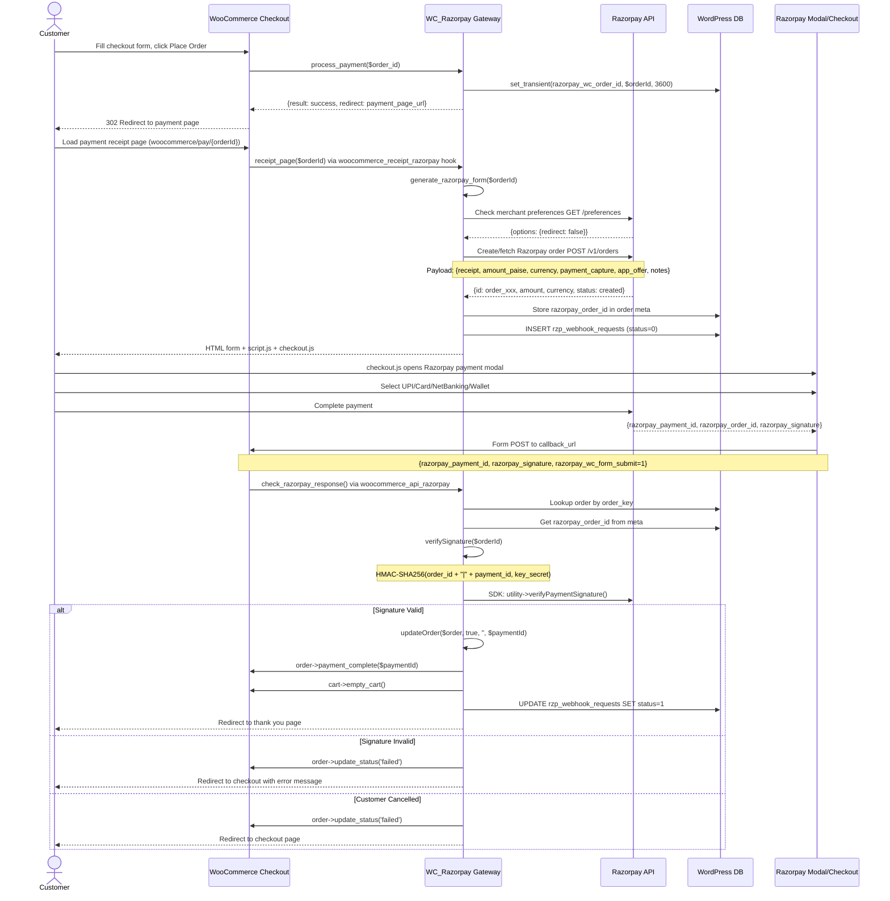
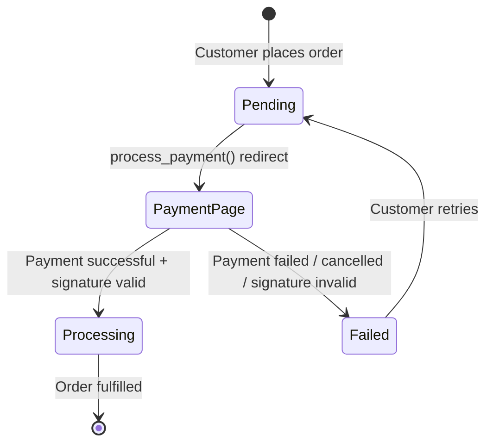

# Standard Payment Flow - Razorpay WooCommerce

## Overview

The standard payment flow handles customers who go through the regular WooCommerce checkout process (cart → checkout → payment).

## Sequence Diagram



## Key Functions

| Function | File | Purpose |
|----------|------|---------|
| `process_payment($order_id)` | `woo-razorpay.php` | Entry point, sets transient, returns redirect |
| `receipt_page($orderId)` | `woo-razorpay.php` | Renders payment form |
| `generate_razorpay_form($orderId)` | `woo-razorpay.php` | Generates HTML + JS |
| `createOrGetRazorpayOrderId()` | `woo-razorpay.php` | Creates/fetches Razorpay order |
| `createRazorpayOrderId()` | `woo-razorpay.php` | Calls Razorpay API to create order |
| `verifyOrderAmount()` | `woo-razorpay.php` | Validates existing order amount matches |
| `check_razorpay_response()` | `woo-razorpay.php` | Handles POST callback |
| `verifySignature()` | `woo-razorpay.php` | HMAC verification |
| `updateOrder()` | `woo-razorpay.php` | Marks WC order complete/failed |

## Order Data Sent to Razorpay

```php
[
    'receipt'         => (string)$orderId,
    'amount'          => (int) round($order->get_total() * 100),  // In paise
    'currency'        => 'INR',  // or other supported currency
    'payment_capture' => 1,  // 0 for authorize-only mode
    'app_offer'       => ($order->get_discount_total() > 0) ? 1 : 0,
    'notes'           => [
        'woocommerce_order_id'     => $orderId,
        'woocommerce_order_number' => $order->get_order_number()
    ],
    // If Route enabled:
    'transfers'       => [...transfer_data...]
]
```

## States and Transitions



## Error Scenarios

| Scenario | Handling |
|----------|---------|
| Razorpay API down during order creation | Returns generic "Payment failed" exception |
| BadRequestError from Razorpay | Error message shown to customer |
| Invalid signature on callback | Order marked failed, user redirected to checkout |
| Customer cancels payment | `razorpay_wc_form_submit=1` with no payment_id → order failed |
| Duplicate payment attempt | `order->needs_payment() === false` check skips re-processing |
