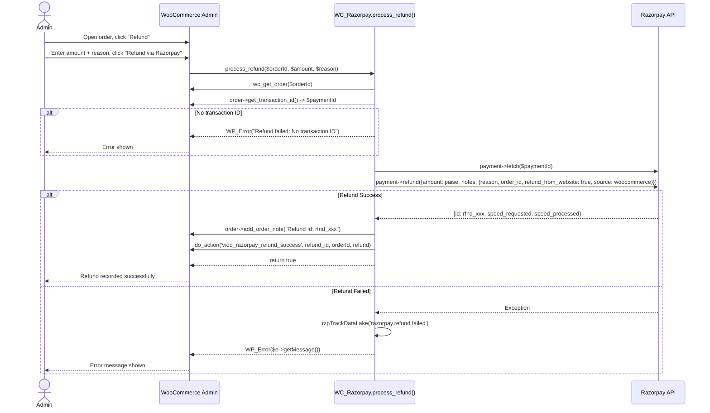
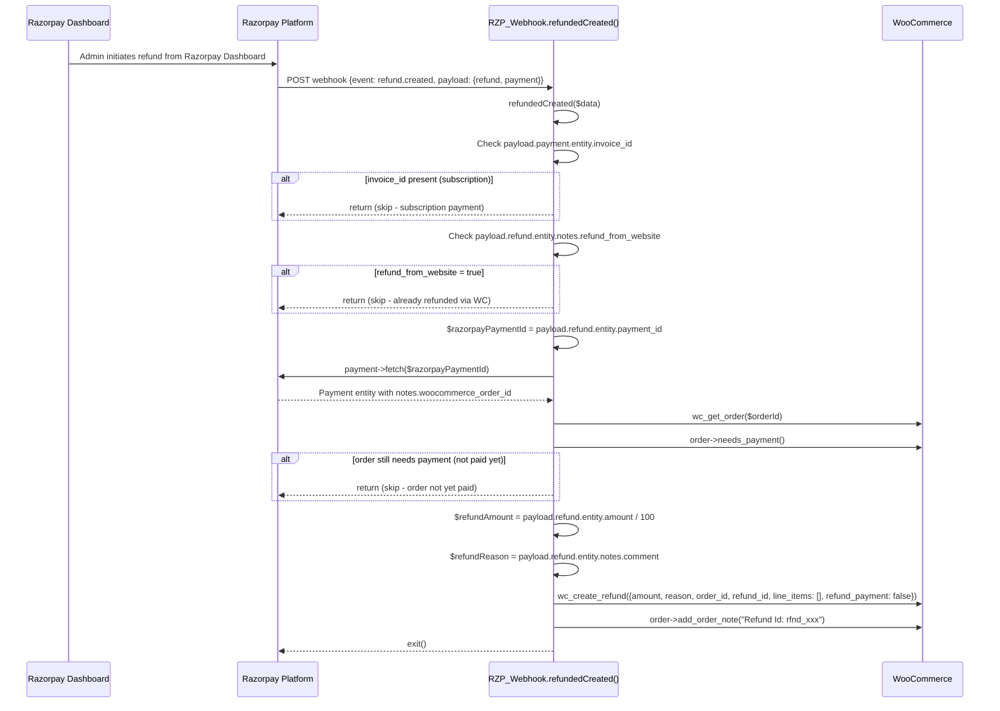
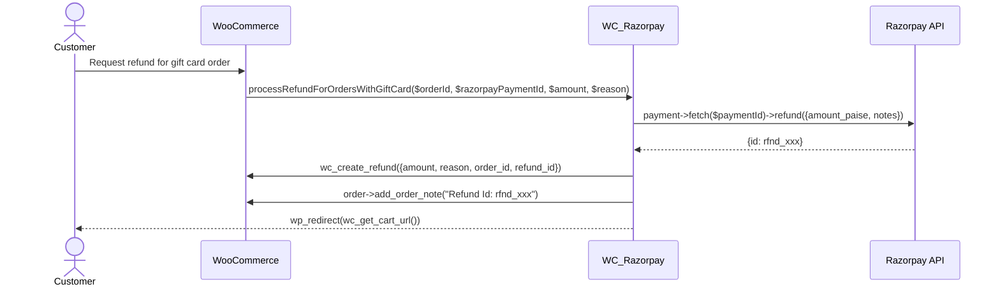

# Refund Flow - Razorpay WooCommerce

## Overview

Refunds can be initiated in two ways:
1. **WC Admin-Initiated**: Admin clicks "Refund" in the WooCommerce order screen
2. **Webhook-Initiated**: Refund created in Razorpay Dashboard, synced to WC via `refund.created` webhook

## Flow 1: WC Admin-Initiated Refund



## Flow 2: Webhook-Initiated Refund (External)



## Special Case: Gift Card Orders

For orders containing gift cards, a separate refund function handles the flow:



## Refund Data Structure

### WC Admin Refund Request to Razorpay API
```php
[
    'amount' => (int) round($amount * 100),  // In paise
    'notes'  => [
        'reason'              => $reason,
        'order_id'            => $orderId,
        'refund_from_website' => true,
        'source'              => 'woocommerce',
    ]
]
```

### Razorpay Refund Speed Types
| Speed | Description |
|-------|-------------|
| `normal` | Standard processing (3-5 business days) |
| `optimum` | Fastest available speed |
| `instant` | Instant refund (if payment method supports it) |

## Duplicate Refund Prevention

The `refund_from_website: true` note is the key mechanism to prevent duplicate refunds when both a WC admin refund and a Razorpay webhook fire for the same refund:

1. WC admin initiates refund → Razorpay API called with `refund_from_website: true`
2. Razorpay sends `refund.created` webhook
3. `refundedCreated()` checks `notes.refund_from_website` → skips if `true`

This prevents double-refunds in WooCommerce.
