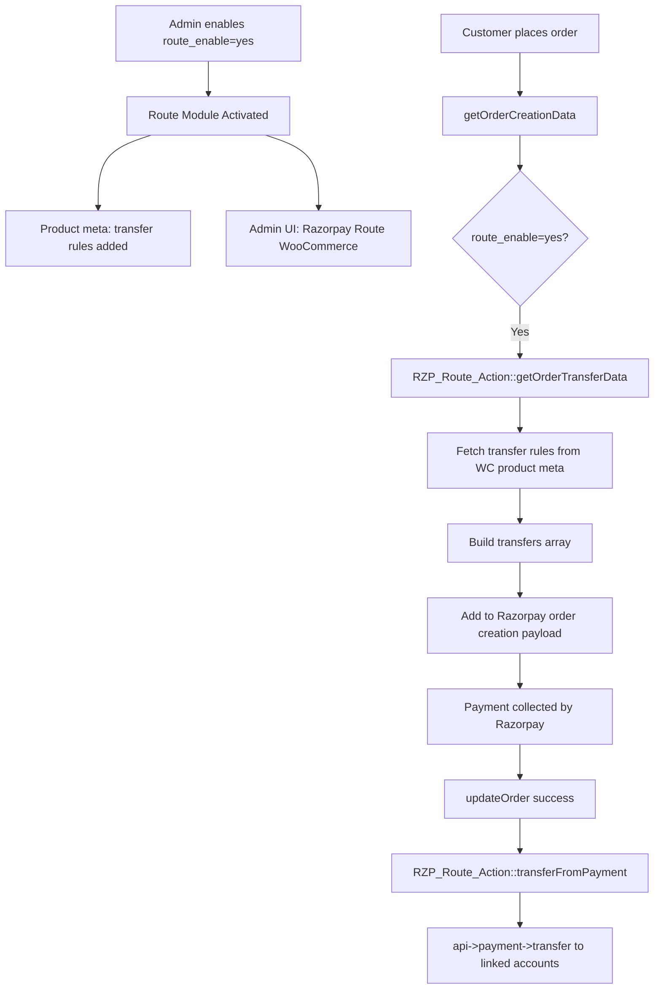
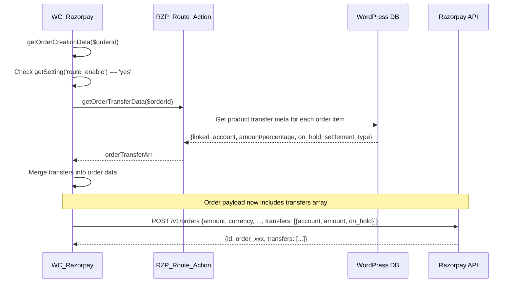
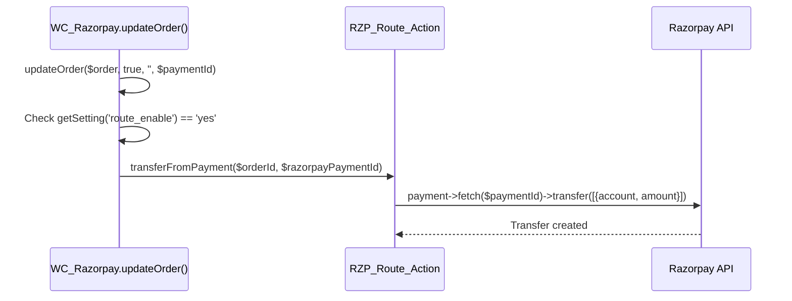
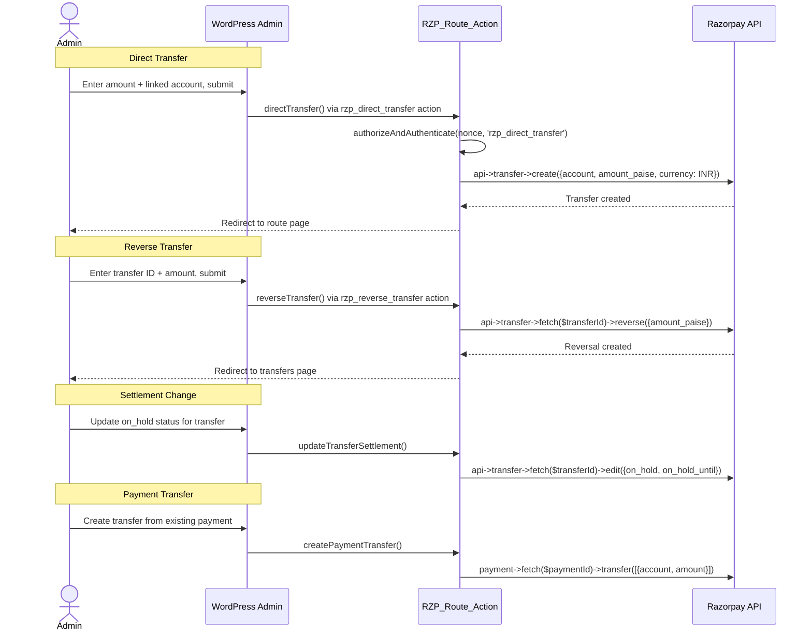
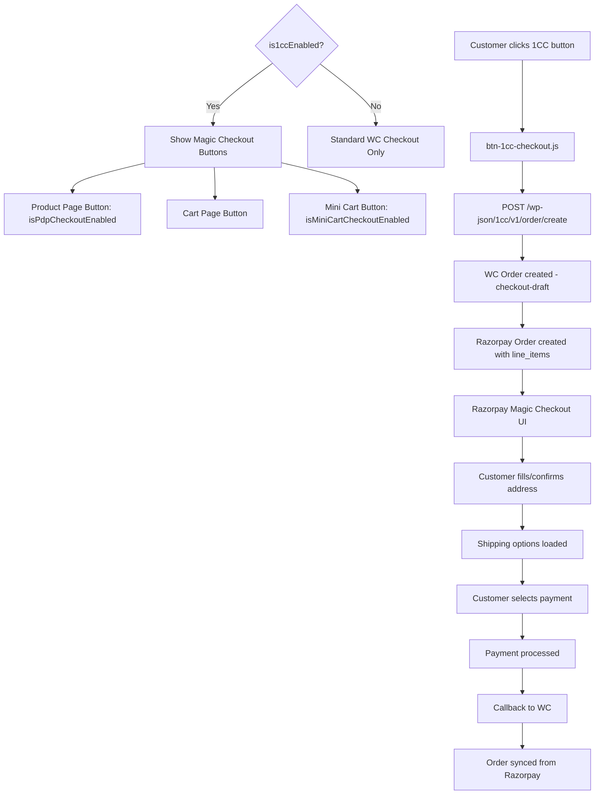
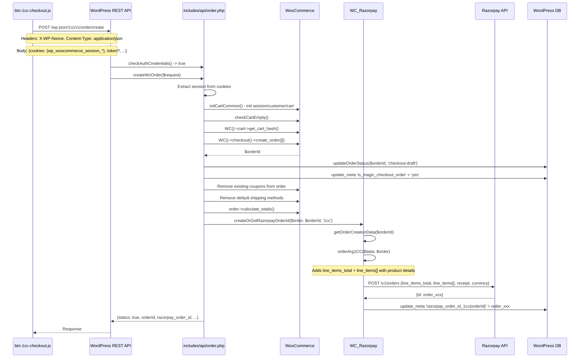
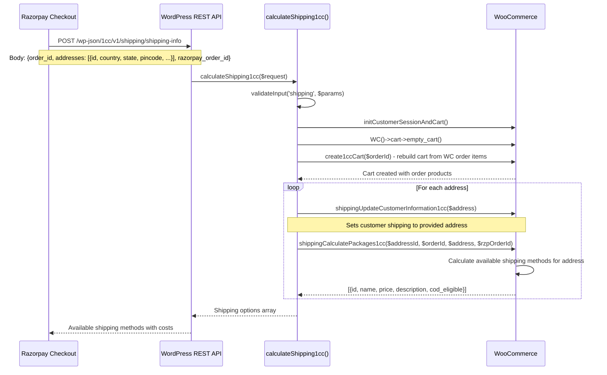
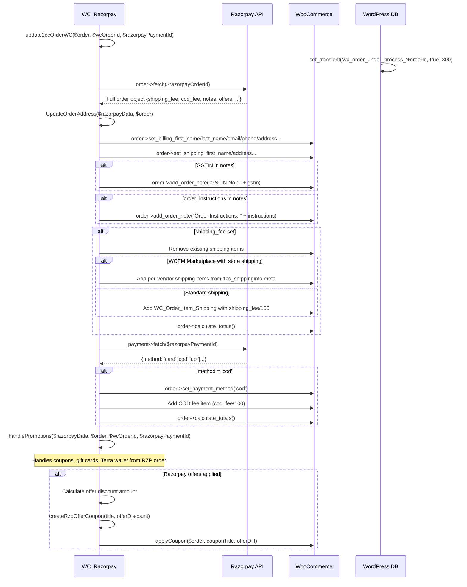
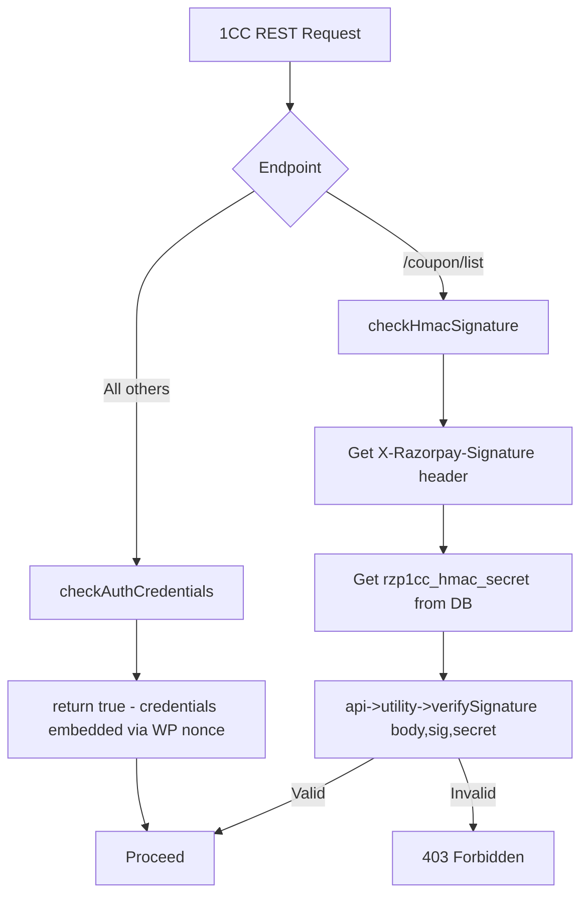
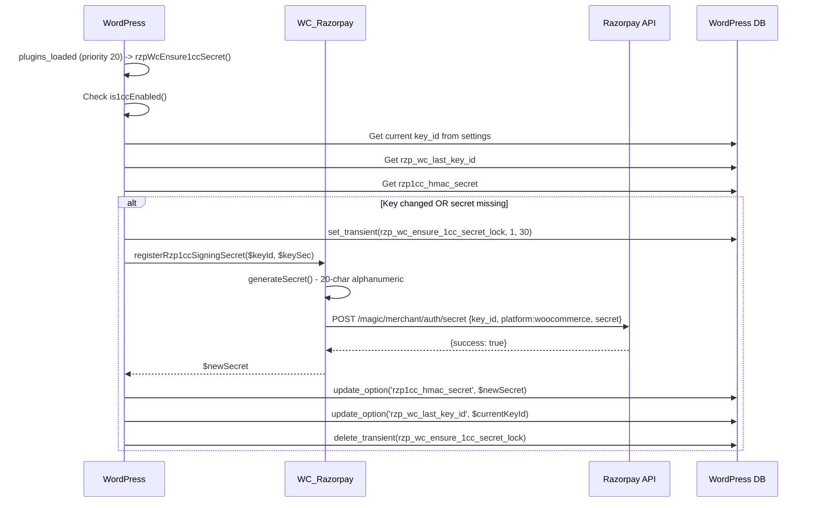

# Route / Magic Checkout Flow - Razorpay WooCommerce

## Overview

This document covers two separate but related features:

1. **Razorpay Route**: Marketplace payment splitting/transfers to linked accounts
2. **Magic Checkout (1CC)**: One-click checkout from product/cart page via Razorpay's hosted experience

---

## Part 1: Razorpay Route

### What is Route?
Route enables marketplace-style payments where a single customer payment is split between the merchant and one or more linked (sub-merchant) accounts.

### Route Architecture



### Route - Order Creation with Transfers



### Route - Post-Payment Transfer



### Route Admin Operations



### Route Admin Pages

| Page | URL | Description |
|------|-----|-------------|
| Razorpay Route | `razorpayRouteWoocommerce` | Main transfers list |
| Transfers | `razorpayTransfers` | Transfer detail view |
| Reversals | `razorpayRouteReversals` | Reversal management |
| Payments | `razorpayRoutePayments` | Payment view |
| Settlement Transfers | `razorpaySettlementTransfers` | Settlement management |
| Payments View | `razorpayPaymentsView` | Payment listing |

---

## Part 2: Magic Checkout (1CC - One-Click Checkout)

### What is Magic Checkout?
Magic Checkout (internally called 1CC) is a Razorpay product that allows customers to complete purchases directly from the product page or cart without going through the full WooCommerce checkout process. Customer data (address, payment method) is pre-filled from their Razorpay profile.

### 1CC Architecture



### 1CC Order Creation - Detailed Flow



### 1CC Line Items Structure

Each product in the cart is sent as a line item to Razorpay:

```php
$data['line_items'][$i] = [
    'type'        => 'e-commerce' | 'gift_card',
    'sku'         => $product->get_sku(),
    'variant_id'  => (string)$item->get_variation_id(),
    'product_id'  => (string)$product_id,
    'weight'      => round(wc_get_weight($product->get_weight(), 'g')),
    'price'       => round(wc_get_price_excluding_tax($product)*100) + tax_per_unit,
    'offer_price' => (int)$sale_price * 100,  // or regular price
    'quantity'    => (int)$item->get_quantity(),
    'name'        => mb_substr($item->get_name(), 0, 125),
    'description' => mb_substr($item->get_name(), 0, 250),
    'image_url'   => wp_get_attachment_url($productImage),
    'product_url' => $product->get_permalink(),
];
```

### 1CC Shipping Calculation Flow



### 1CC Order Completion - Address and Data Sync



### 1CC REST API Authentication



### 1CC Configuration Options

| Setting Key | Purpose | Default |
|------------|---------|---------|
| `enable_1cc` | Master toggle for Magic Checkout | `no` |
| `enable_1cc_test_mode` | Only show to logged-in admins | `no` |
| `enable_1cc_debug_mode` | Enable debug logging | `yes` |
| `enable_1cc_pdp_checkout` | Show button on product pages | `no` |
| `enable_1cc_mini_cart_checkout` | Show button in mini cart | `no` |
| `enable_1cc_mandatory_login` | Require Razorpay login | `no` |
| `enable_1cc_ga_analytics` | Google Analytics integration | `no` |
| `enable_1cc_fb_analytics` | Facebook Pixel integration | `no` |
| `1cc_min_cart_amount` | Minimum cart total for 1CC | `0` |
| `1cc_min_COD_slab_amount` | Min order for COD | - |
| `1cc_max_COD_slab_amount` | Max order for COD | - |
| `1cc_account_creation` | Allow account creation | `no` |

### 1CC HMAC Secret Management


