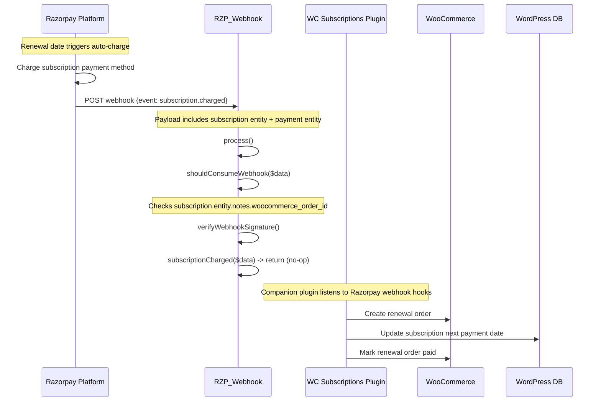
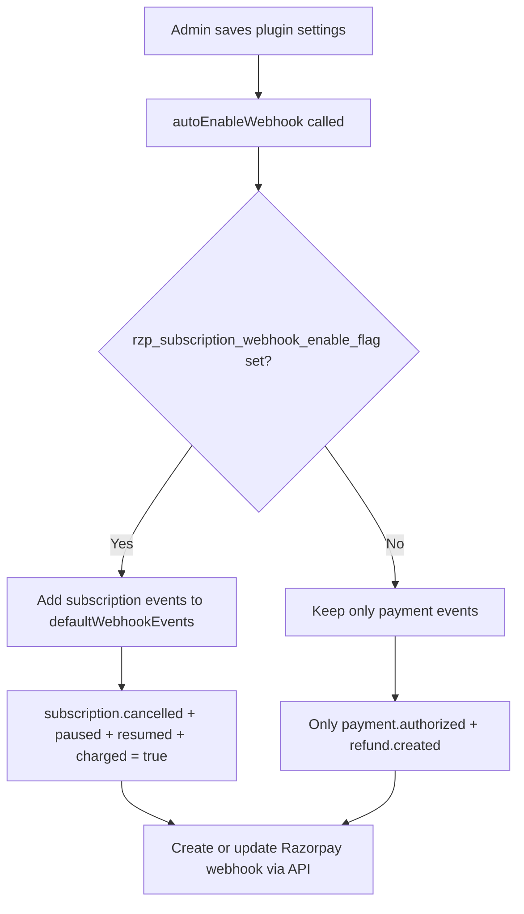

# Subscription Flow - Razorpay WooCommerce

## Overview

Subscription payments in Razorpay WooCommerce involve recurring billing managed by Razorpay. The base plugin handles webhook events for subscription lifecycle; actual subscription creation/management is done by a companion WooCommerce Subscriptions plugin.

## Webhook Events for Subscriptions

The base plugin registers these subscription webhook events when `rzp_subscription_webhook_enable_flag` is set:

| Event | Handler | Action |
|-------|---------|--------|
| `subscription.charged` | `subscriptionCharged()` | No-op (companion plugin handles) |
| `subscription.cancelled` | `subscriptionCancelled()` | No-op |
| `subscription.paused` | `subscriptionPaused()` | No-op |
| `subscription.resumed` | `subscriptionResumed()` | No-op |

## Subscription Webhook Processing Flow



## Subscription Webhook Registration

When settings are saved:



## Supported Subscription Events in eventsArray

```php
protected $eventsArray = [
    'payment.authorized',
    'virtual_account.credited',
    'refund.created',
    'payment.failed',
    'payment.pending',
    'subscription.cancelled',   // Added when flag set
    'subscription.paused',      // Added when flag set
    'subscription.resumed',     // Added when flag set
    'subscription.charged',     // Added when flag set
];
```

## Notes for Subscription Integration

1. The `notes.woocommerce_order_id` in subscription entity must be set by the subscription plugin when creating the Razorpay subscription
2. Invoice payments (subscription-linked) are explicitly skipped in `paymentAuthorized()`: `if (isset($data['invoice_id'])) return;`
3. The `subscriptionCharged` event payload contains both subscription entity AND payment entity
4. For the `subscription.charged` event, `$razorpayOrderId` is the payment's order_id; for other subscription events, it's set to `"No payment id in subscription event"`
