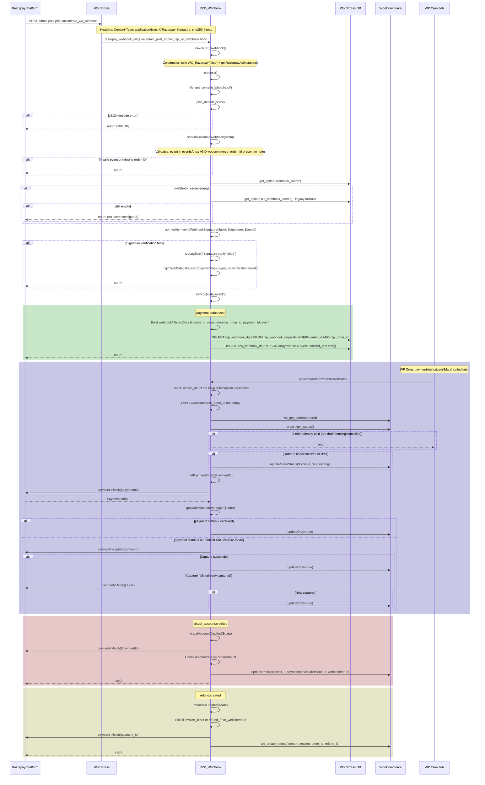

# Webhook Flow - Razorpay WooCommerce

## Overview

Razorpay webhooks provide server-to-server notifications for payment events. The plugin processes them asynchronously to prevent timeout issues and ensure idempotent order processing.

## Webhook URL

```
{site_url}/wp-admin/admin-post.php?action=rzp_wc_webhook
```

Configured automatically when API keys are saved. Webhook secret is auto-generated and stored in `webhook_secret` option.

## Supported Webhook Events

| Event | Handler Method | Action |
|-------|---------------|--------|
| `payment.authorized` | `paymentAuthorized()` | Store in DB, capture if needed |
| `payment.pending` | `paymentPending()` | Handle COD pending payments |
| `payment.failed` | `paymentFailed()` | No-op (return) |
| `refund.created` | `refundedCreated()` | Create WC refund |
| `virtual_account.credited` | `virtualAccountCredited()` | Process bank transfer payment |
| `subscription.charged` | `subscriptionCharged()` | No-op (companion plugin handles) |
| `subscription.cancelled` | `subscriptionCancelled()` | No-op |
| `subscription.paused` | `subscriptionPaused()` | No-op |
| `subscription.resumed` | `subscriptionResumed()` | No-op |

## Complete Webhook Processing Sequence



## Webhook Database Schema

### Table: `wp_rzp_webhook_requests`

```sql
CREATE TABLE wp_rzp_webhook_requests (
    id                          BIGINT(20) AUTO_INCREMENT PRIMARY KEY,
    integration                 VARCHAR(50) DEFAULT 'woocommerce',
    order_id                    BIGINT(20) NOT NULL,
    rzp_order_id                VARCHAR(100) NOT NULL,
    rzp_webhook_data            LONGTEXT DEFAULT '[]',
    rzp_update_order_cron_status TINYINT(1) DEFAULT 0,
    rzp_webhook_notified_at     BIGINT(20),
    created_at                  TIMESTAMP DEFAULT CURRENT_TIMESTAMP
);
```

**Status Values for `rzp_update_order_cron_status`:**
- `0` = `RZP_ORDER_CREATED` - Order created, webhook pending
- `1` = `RZP_ORDER_PROCESSED_BY_CALLBACK` - Already processed by payment callback

## Webhook Auto-Registration

When admin saves plugin settings:

```mermaid
flowchart TD
    A[autoEnableWebhook called] --> B{Key ID and Secret present?}
    B -->|No| C[Show error: Keys required]
    B -->|Yes| D[Validate keys via GET /v1/orders]
    D -->|Invalid| E[Show error: Invalid keys]
    D -->|Valid| F{Domain is public IP?}
    F -->|localhost| G[Show error: Cannot use localhost]
    F -->|Public| H[GET /v1/webhooks list]
    H --> I{Webhook URL exists?}
    I -->|Exists| J[PUT /v1/webhooks/{id} - update events]
    I -->|Not exists| K[POST /v1/webhooks/ - create new]
    J --> L[Track: autowebhook.updated]
    K --> M[Track: autowebhook.created]
```

## Signature Verification

The webhook signature is a SHA-256 HMAC of the raw request body using the webhook secret:

```php
// Razorpay SDK handles this:
$api->utility->verifyWebhookSignature($rawBody, $xRazorpaySignature, $webhookSecret);

// Internally:
// expected = HMAC-SHA256($rawBody, $webhookSecret)
// Compare with $xRazorpaySignature using hash_equals()
```

## Idempotency Handling

| Check | Where | Purpose |
|-------|-------|---------|
| `order->needs_payment()` | `paymentAuthorized()` | Skip if already paid |
| `rzp_update_order_cron_status = 1` | Cron job | Skip if callback already processed |
| `refund_from_website = true` | `refundedCreated()` | Skip webhook-initiated duplicate refund |
| `invoice_id` check | Multiple handlers | Skip subscription/invoice payments in main flow |
